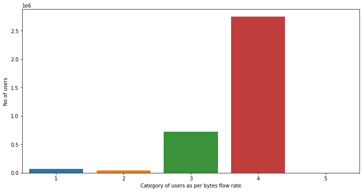
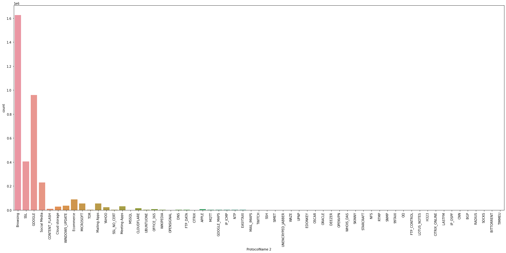
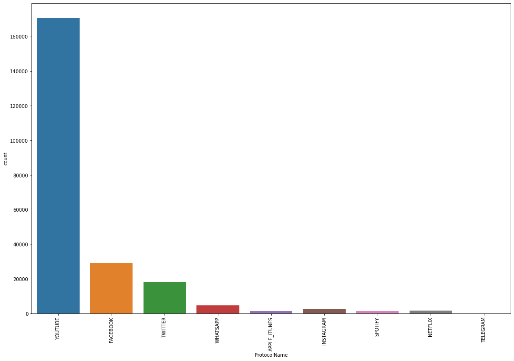
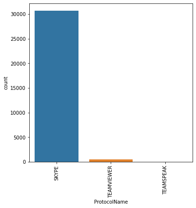
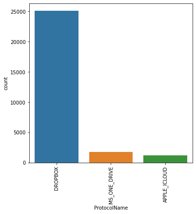
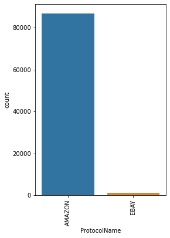
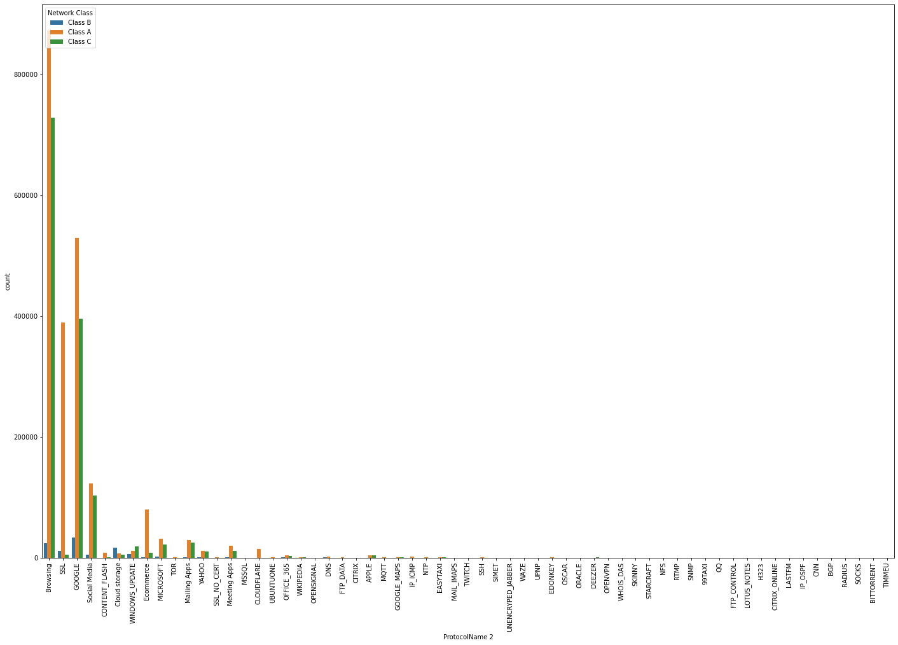
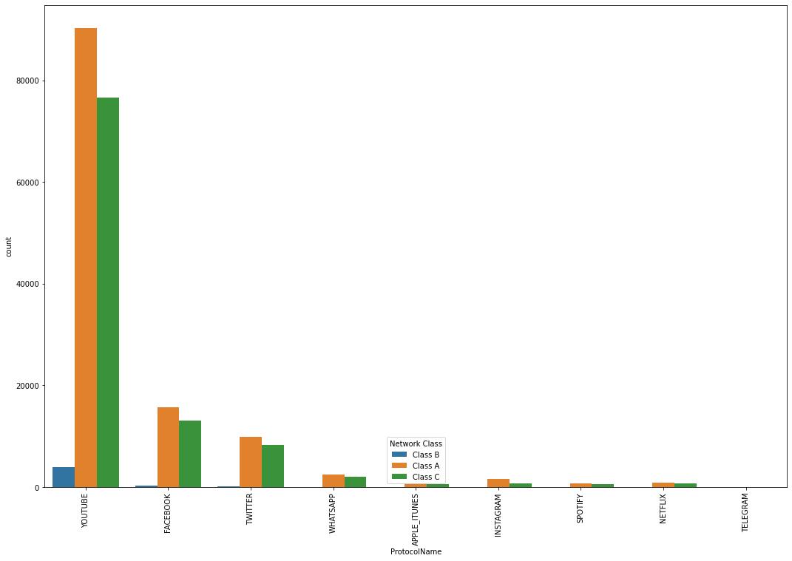
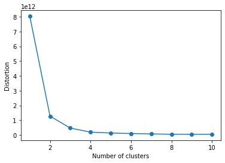

```python

import numpy as np 
import pandas as pd
```


```python
df = pd.read_csv('C:\\Users\\OPIPLEX\\Desktop\\archive\\traffic data.csv')
```


```python
df
```


<div>
<style scoped>
    .dataframe tbody tr th:only-of-type {
        vertical-align: middle;
    }

    .dataframe tbody tr th {
        vertical-align: top;
    }

    .dataframe thead th {
        text-align: right;
    }
</style>
<table border="1" class="dataframe">
  <thead>
    <tr style="text-align: right;">
      <th></th>
      <th>Flow.ID</th>
      <th>Source.IP</th>
      <th>Source.Port</th>
      <th>Destination.IP</th>
      <th>Destination.Port</th>
      <th>Protocol</th>
      <th>Timestamp</th>
      <th>Flow.Duration</th>
      <th>Total.Fwd.Packets</th>
      <th>Total.Backward.Packets</th>
      <th>...</th>
      <th>Active.Std</th>
      <th>Active.Max</th>
      <th>Active.Min</th>
      <th>Idle.Mean</th>
      <th>Idle.Std</th>
      <th>Idle.Max</th>
      <th>Idle.Min</th>
      <th>Label</th>
      <th>L7Protocol</th>
      <th>ProtocolName</th>
    </tr>
  </thead>
  <tbody>
    <tr>
      <th>0</th>
      <td>172.19.1.46-10.200.7.7-52422-3128-6</td>
      <td>172.19.1.46</td>
      <td>52422</td>
      <td>10.200.7.7</td>
      <td>3128</td>
      <td>6</td>
      <td>26/04/201711:11:17</td>
      <td>45523</td>
      <td>22</td>
      <td>55</td>
      <td>...</td>
      <td>0.0</td>
      <td>0.0</td>
      <td>0.0</td>
      <td>0.0</td>
      <td>0.0</td>
      <td>0.0</td>
      <td>0.0</td>
      <td>BENIGN</td>
      <td>131</td>
      <td>HTTP_PROXY</td>
    </tr>
    <tr>
      <th>1</th>
      <td>172.19.1.46-10.200.7.7-52422-3128-6</td>
      <td>10.200.7.7</td>
      <td>3128</td>
      <td>172.19.1.46</td>
      <td>52422</td>
      <td>6</td>
      <td>26/04/201711:11:17</td>
      <td>1</td>
      <td>2</td>
      <td>0</td>
      <td>...</td>
      <td>0.0</td>
      <td>0.0</td>
      <td>0.0</td>
      <td>0.0</td>
      <td>0.0</td>
      <td>0.0</td>
      <td>0.0</td>
      <td>BENIGN</td>
      <td>131</td>
      <td>HTTP_PROXY</td>
    </tr>
    <tr>
      <th>2</th>
      <td>10.200.7.217-50.31.185.39-38848-80-6</td>
      <td>50.31.185.39</td>
      <td>80</td>
      <td>10.200.7.217</td>
      <td>38848</td>
      <td>6</td>
      <td>26/04/201711:11:17</td>
      <td>1</td>
      <td>3</td>
      <td>0</td>
      <td>...</td>
      <td>0.0</td>
      <td>0.0</td>
      <td>0.0</td>
      <td>0.0</td>
      <td>0.0</td>
      <td>0.0</td>
      <td>0.0</td>
      <td>BENIGN</td>
      <td>7</td>
      <td>HTTP</td>
    </tr>
    <tr>
      <th>3</th>
      <td>10.200.7.217-50.31.185.39-38848-80-6</td>
      <td>50.31.185.39</td>
      <td>80</td>
      <td>10.200.7.217</td>
      <td>38848</td>
      <td>6</td>
      <td>26/04/201711:11:17</td>
      <td>217</td>
      <td>1</td>
      <td>3</td>
      <td>...</td>
      <td>0.0</td>
      <td>0.0</td>
      <td>0.0</td>
      <td>0.0</td>
      <td>0.0</td>
      <td>0.0</td>
      <td>0.0</td>
      <td>BENIGN</td>
      <td>7</td>
      <td>HTTP</td>
    </tr>
    <tr>
      <th>4</th>
      <td>192.168.72.43-10.200.7.7-55961-3128-6</td>
      <td>192.168.72.43</td>
      <td>55961</td>
      <td>10.200.7.7</td>
      <td>3128</td>
      <td>6</td>
      <td>26/04/201711:11:17</td>
      <td>78068</td>
      <td>5</td>
      <td>0</td>
      <td>...</td>
      <td>0.0</td>
      <td>0.0</td>
      <td>0.0</td>
      <td>0.0</td>
      <td>0.0</td>
      <td>0.0</td>
      <td>0.0</td>
      <td>BENIGN</td>
      <td>131</td>
      <td>HTTP_PROXY</td>
    </tr>
    <tr>
      <th>...</th>
      <td>...</td>
      <td>...</td>
      <td>...</td>
      <td>...</td>
      <td>...</td>
      <td>...</td>
      <td>...</td>
      <td>...</td>
      <td>...</td>
      <td>...</td>
      <td>...</td>
      <td>...</td>
      <td>...</td>
      <td>...</td>
      <td>...</td>
      <td>...</td>
      <td>...</td>
      <td>...</td>
      <td>...</td>
      <td>...</td>
      <td>...</td>
    </tr>
    <tr>
      <th>3577291</th>
      <td>10.200.7.199-98.138.79.73-42135-443-6</td>
      <td>98.138.79.73</td>
      <td>443</td>
      <td>10.200.7.199</td>
      <td>42135</td>
      <td>6</td>
      <td>15/05/201705:43:40</td>
      <td>2290821</td>
      <td>5</td>
      <td>4</td>
      <td>...</td>
      <td>0.0</td>
      <td>0.0</td>
      <td>0.0</td>
      <td>0.0</td>
      <td>0.0</td>
      <td>0.0</td>
      <td>0.0</td>
      <td>BENIGN</td>
      <td>91</td>
      <td>SSL</td>
    </tr>
    <tr>
      <th>3577292</th>
      <td>10.200.7.217-98.138.79.73-51546-443-6</td>
      <td>98.138.79.73</td>
      <td>443</td>
      <td>10.200.7.217</td>
      <td>51546</td>
      <td>6</td>
      <td>15/05/201705:46:10</td>
      <td>24</td>
      <td>5</td>
      <td>0</td>
      <td>...</td>
      <td>0.0</td>
      <td>0.0</td>
      <td>0.0</td>
      <td>0.0</td>
      <td>0.0</td>
      <td>0.0</td>
      <td>0.0</td>
      <td>BENIGN</td>
      <td>91</td>
      <td>SSL</td>
    </tr>
    <tr>
      <th>3577293</th>
      <td>10.200.7.218-98.138.79.73-44366-443-6</td>
      <td>98.138.79.73</td>
      <td>443</td>
      <td>10.200.7.218</td>
      <td>44366</td>
      <td>6</td>
      <td>15/05/201705:45:39</td>
      <td>2591653</td>
      <td>6</td>
      <td>5</td>
      <td>...</td>
      <td>0.0</td>
      <td>0.0</td>
      <td>0.0</td>
      <td>0.0</td>
      <td>0.0</td>
      <td>0.0</td>
      <td>0.0</td>
      <td>BENIGN</td>
      <td>91</td>
      <td>SSL</td>
    </tr>
    <tr>
      <th>3577294</th>
      <td>10.200.7.195-98.138.79.73-52341-443-6</td>
      <td>98.138.79.73</td>
      <td>443</td>
      <td>10.200.7.195</td>
      <td>52341</td>
      <td>6</td>
      <td>15/05/201705:45:59</td>
      <td>2622421</td>
      <td>4</td>
      <td>3</td>
      <td>...</td>
      <td>0.0</td>
      <td>0.0</td>
      <td>0.0</td>
      <td>0.0</td>
      <td>0.0</td>
      <td>0.0</td>
      <td>0.0</td>
      <td>BENIGN</td>
      <td>91</td>
      <td>SSL</td>
    </tr>
    <tr>
      <th>3577295</th>
      <td>10.200.7.196-98.138.79.73-34188-443-6</td>
      <td>98.138.79.73</td>
      <td>443</td>
      <td>10.200.7.196</td>
      <td>34188</td>
      <td>6</td>
      <td>15/05/201705:46:05</td>
      <td>2009138</td>
      <td>3</td>
      <td>2</td>
      <td>...</td>
      <td>0.0</td>
      <td>0.0</td>
      <td>0.0</td>
      <td>0.0</td>
      <td>0.0</td>
      <td>0.0</td>
      <td>0.0</td>
      <td>BENIGN</td>
      <td>91</td>
      <td>SSL</td>
    </tr>
  </tbody>
</table>
<p>3577296 rows × 87 columns</p>
</div>


```python
df.Label.unique()
```


    array(['BENIGN'], dtype=object)


```python
df.describe()
```


<div>
<style scoped>
    .dataframe tbody tr th:only-of-type {
        vertical-align: middle;
    }

    .dataframe tbody tr th {
        vertical-align: top;
    }

    .dataframe thead th {
        text-align: right;
    }
</style>
<table border="1" class="dataframe">
  <thead>
    <tr style="text-align: right;">
      <th></th>
      <th>Source.Port</th>
      <th>Destination.Port</th>
      <th>Protocol</th>
      <th>Flow.Duration</th>
      <th>Total.Fwd.Packets</th>
      <th>Total.Backward.Packets</th>
      <th>Total.Length.of.Fwd.Packets</th>
      <th>Total.Length.of.Bwd.Packets</th>
      <th>Fwd.Packet.Length.Max</th>
      <th>Fwd.Packet.Length.Min</th>
      <th>...</th>
      <th>min_seg_size_forward</th>
      <th>Active.Mean</th>
      <th>Active.Std</th>
      <th>Active.Max</th>
      <th>Active.Min</th>
      <th>Idle.Mean</th>
      <th>Idle.Std</th>
      <th>Idle.Max</th>
      <th>Idle.Min</th>
      <th>L7Protocol</th>
    </tr>
  </thead>
  <tbody>
    <tr>
      <th>count</th>
      <td>3.577296e+06</td>
      <td>3.577296e+06</td>
      <td>3.577296e+06</td>
      <td>3.577296e+06</td>
      <td>3.577296e+06</td>
      <td>3.577296e+06</td>
      <td>3.577296e+06</td>
      <td>3.577296e+06</td>
      <td>3.577296e+06</td>
      <td>3.577296e+06</td>
      <td>...</td>
      <td>3.577296e+06</td>
      <td>3.577296e+06</td>
      <td>3.577296e+06</td>
      <td>3.577296e+06</td>
      <td>3.577296e+06</td>
      <td>3.577296e+06</td>
      <td>3.577296e+06</td>
      <td>3.577296e+06</td>
      <td>3.577296e+06</td>
      <td>3.577296e+06</td>
    </tr>
    <tr>
      <th>mean</th>
      <td>3.799938e+04</td>
      <td>1.204246e+04</td>
      <td>6.005508e+00</td>
      <td>2.544247e+07</td>
      <td>6.237799e+01</td>
      <td>6.534083e+01</td>
      <td>4.683323e+04</td>
      <td>8.445742e+04</td>
      <td>5.123645e+02</td>
      <td>9.340408e+00</td>
      <td>...</td>
      <td>2.569738e+01</td>
      <td>2.981990e+05</td>
      <td>1.836406e+05</td>
      <td>5.229372e+05</td>
      <td>1.676336e+05</td>
      <td>8.524211e+06</td>
      <td>1.370991e+06</td>
      <td>9.743845e+06</td>
      <td>7.252097e+06</td>
      <td>1.029508e+02</td>
    </tr>
    <tr>
      <th>std</th>
      <td>2.201713e+04</td>
      <td>2.044916e+04</td>
      <td>3.274574e-01</td>
      <td>4.014430e+07</td>
      <td>1.094086e+03</td>
      <td>1.108092e+03</td>
      <td>1.816196e+06</td>
      <td>2.124319e+06</td>
      <td>1.039319e+03</td>
      <td>8.299983e+01</td>
      <td>...</td>
      <td>6.025989e+00</td>
      <td>2.349390e+06</td>
      <td>1.325838e+06</td>
      <td>3.266508e+06</td>
      <td>2.064219e+06</td>
      <td>1.706568e+07</td>
      <td>4.814474e+06</td>
      <td>1.888557e+07</td>
      <td>1.600754e+07</td>
      <td>5.129198e+01</td>
    </tr>
    <tr>
      <th>min</th>
      <td>0.000000e+00</td>
      <td>0.000000e+00</td>
      <td>0.000000e+00</td>
      <td>1.000000e+00</td>
      <td>1.000000e+00</td>
      <td>0.000000e+00</td>
      <td>0.000000e+00</td>
      <td>0.000000e+00</td>
      <td>0.000000e+00</td>
      <td>0.000000e+00</td>
      <td>...</td>
      <td>-1.000000e+00</td>
      <td>0.000000e+00</td>
      <td>0.000000e+00</td>
      <td>0.000000e+00</td>
      <td>0.000000e+00</td>
      <td>0.000000e+00</td>
      <td>0.000000e+00</td>
      <td>0.000000e+00</td>
      <td>0.000000e+00</td>
      <td>1.000000e+00</td>
    </tr>
    <tr>
      <th>25%</th>
      <td>3.697000e+03</td>
      <td>4.430000e+02</td>
      <td>6.000000e+00</td>
      <td>6.280000e+02</td>
      <td>2.000000e+00</td>
      <td>1.000000e+00</td>
      <td>1.200000e+01</td>
      <td>0.000000e+00</td>
      <td>6.000000e+00</td>
      <td>0.000000e+00</td>
      <td>...</td>
      <td>2.000000e+01</td>
      <td>0.000000e+00</td>
      <td>0.000000e+00</td>
      <td>0.000000e+00</td>
      <td>0.000000e+00</td>
      <td>0.000000e+00</td>
      <td>0.000000e+00</td>
      <td>0.000000e+00</td>
      <td>0.000000e+00</td>
      <td>9.100000e+01</td>
    </tr>
    <tr>
      <th>50%</th>
      <td>4.937700e+04</td>
      <td>3.128000e+03</td>
      <td>6.000000e+00</td>
      <td>5.847295e+05</td>
      <td>6.000000e+00</td>
      <td>5.000000e+00</td>
      <td>4.430000e+02</td>
      <td>2.080000e+02</td>
      <td>2.060000e+02</td>
      <td>0.000000e+00</td>
      <td>...</td>
      <td>2.000000e+01</td>
      <td>0.000000e+00</td>
      <td>0.000000e+00</td>
      <td>0.000000e+00</td>
      <td>0.000000e+00</td>
      <td>0.000000e+00</td>
      <td>0.000000e+00</td>
      <td>0.000000e+00</td>
      <td>0.000000e+00</td>
      <td>1.260000e+02</td>
    </tr>
    <tr>
      <th>75%</th>
      <td>5.379900e+04</td>
      <td>3.128000e+03</td>
      <td>6.000000e+00</td>
      <td>4.500153e+07</td>
      <td>1.500000e+01</td>
      <td>1.500000e+01</td>
      <td>1.769000e+03</td>
      <td>3.629000e+03</td>
      <td>6.130000e+02</td>
      <td>6.000000e+00</td>
      <td>...</td>
      <td>3.200000e+01</td>
      <td>4.500000e+01</td>
      <td>0.000000e+00</td>
      <td>5.700000e+01</td>
      <td>2.000000e+00</td>
      <td>7.506747e+06</td>
      <td>0.000000e+00</td>
      <td>8.034389e+06</td>
      <td>5.369712e+06</td>
      <td>1.300000e+02</td>
    </tr>
    <tr>
      <th>max</th>
      <td>6.553400e+04</td>
      <td>6.553400e+04</td>
      <td>1.700000e+01</td>
      <td>1.200000e+08</td>
      <td>4.531900e+05</td>
      <td>5.421960e+05</td>
      <td>6.780236e+08</td>
      <td>1.345796e+09</td>
      <td>3.283200e+04</td>
      <td>1.606000e+04</td>
      <td>...</td>
      <td>5.230000e+02</td>
      <td>1.146950e+08</td>
      <td>7.297136e+07</td>
      <td>1.146950e+08</td>
      <td>1.146950e+08</td>
      <td>1.200000e+08</td>
      <td>7.738746e+07</td>
      <td>1.200000e+08</td>
      <td>1.200000e+08</td>
      <td>2.220000e+02</td>
    </tr>
  </tbody>
</table>
<p>8 rows × 81 columns</p>
</div>


```python
df.info()
```

    <class 'pandas.core.frame.DataFrame'>
    RangeIndex: 3577296 entries, 0 to 3577295
    Data columns (total 87 columns):
     #   Column                       Dtype  
    ---  ------                       -----  
     0   Flow.ID                      object 
     1   Source.IP                    object 
     2   Source.Port                  int64  
     3   Destination.IP               object 
     4   Destination.Port             int64  
     5   Protocol                     int64  
     6   Timestamp                    object 
     7   Flow.Duration                int64  
     8   Total.Fwd.Packets            int64  
     9   Total.Backward.Packets       int64  
     10  Total.Length.of.Fwd.Packets  int64  
     11  Total.Length.of.Bwd.Packets  float64
     12  Fwd.Packet.Length.Max        int64  
     13  Fwd.Packet.Length.Min        int64  
     14  Fwd.Packet.Length.Mean       float64
     15  Fwd.Packet.Length.Std        float64
     16  Bwd.Packet.Length.Max        int64  
     17  Bwd.Packet.Length.Min        int64  
     18  Bwd.Packet.Length.Mean       float64
     19  Bwd.Packet.Length.Std        float64
     20  Flow.Bytes.s                 float64
     21  Flow.Packets.s               float64
     22  Flow.IAT.Mean                float64
     23  Flow.IAT.Std                 float64
     24  Flow.IAT.Max                 float64
     25  Flow.IAT.Min                 int64  
     26  Fwd.IAT.Total                float64
     27  Fwd.IAT.Mean                 float64
     28  Fwd.IAT.Std                  float64
     29  Fwd.IAT.Max                  float64
     30  Fwd.IAT.Min                  float64
     31  Bwd.IAT.Total                float64
     32  Bwd.IAT.Mean                 float64
     33  Bwd.IAT.Std                  float64
     34  Bwd.IAT.Max                  float64
     35  Bwd.IAT.Min                  float64
     36  Fwd.PSH.Flags                int64  
     37  Bwd.PSH.Flags                int64  
     38  Fwd.URG.Flags                int64  
     39  Bwd.URG.Flags                int64  
     40  Fwd.Header.Length            int64  
     41  Bwd.Header.Length            int64  
     42  Fwd.Packets.s                float64
     43  Bwd.Packets.s                float64
     44  Min.Packet.Length            int64  
     45  Max.Packet.Length            int64  
     46  Packet.Length.Mean           float64
     47  Packet.Length.Std            float64
     48  Packet.Length.Variance       float64
     49  FIN.Flag.Count               int64  
     50  SYN.Flag.Count               int64  
     51  RST.Flag.Count               int64  
     52  PSH.Flag.Count               int64  
     53  ACK.Flag.Count               int64  
     54  URG.Flag.Count               int64  
     55  CWE.Flag.Count               int64  
     56  ECE.Flag.Count               int64  
     57  Down.Up.Ratio                int64  
     58  Average.Packet.Size          float64
     59  Avg.Fwd.Segment.Size         float64
     60  Avg.Bwd.Segment.Size         float64
     61  Fwd.Header.Length.1          int64  
     62  Fwd.Avg.Bytes.Bulk           int64  
     63  Fwd.Avg.Packets.Bulk         int64  
     64  Fwd.Avg.Bulk.Rate            int64  
     65  Bwd.Avg.Bytes.Bulk           int64  
     66  Bwd.Avg.Packets.Bulk         int64  
     67  Bwd.Avg.Bulk.Rate            int64  
     68  Subflow.Fwd.Packets          int64  
     69  Subflow.Fwd.Bytes            int64  
     70  Subflow.Bwd.Packets          int64  
     71  Subflow.Bwd.Bytes            int64  
     72  Init_Win_bytes_forward       int64  
     73  Init_Win_bytes_backward      int64  
     74  act_data_pkt_fwd             int64  
     75  min_seg_size_forward         int64  
     76  Active.Mean                  float64
     77  Active.Std                   float64
     78  Active.Max                   float64
     79  Active.Min                   float64
     80  Idle.Mean                    float64
     81  Idle.Std                     float64
     82  Idle.Max                     float64
     83  Idle.Min                     float64
     84  Label                        object 
     85  L7Protocol                   int64  
     86  ProtocolName                 object 
    dtypes: float64(36), int64(45), object(6)
    memory usage: 2.3+ GB
    


```python
df = df.dropna()
```


```python
df
```


<div>
<style scoped>
    .dataframe tbody tr th:only-of-type {
        vertical-align: middle;
    }

    .dataframe tbody tr th {
        vertical-align: top;
    }

    .dataframe thead th {
        text-align: right;
    }
</style>
<table border="1" class="dataframe">
  <thead>
    <tr style="text-align: right;">
      <th></th>
      <th>Flow.ID</th>
      <th>Source.IP</th>
      <th>Source.Port</th>
      <th>Destination.IP</th>
      <th>Destination.Port</th>
      <th>Protocol</th>
      <th>Timestamp</th>
      <th>Flow.Duration</th>
      <th>Total.Fwd.Packets</th>
      <th>Total.Backward.Packets</th>
      <th>...</th>
      <th>Active.Std</th>
      <th>Active.Max</th>
      <th>Active.Min</th>
      <th>Idle.Mean</th>
      <th>Idle.Std</th>
      <th>Idle.Max</th>
      <th>Idle.Min</th>
      <th>Label</th>
      <th>L7Protocol</th>
      <th>ProtocolName</th>
    </tr>
  </thead>
  <tbody>
    <tr>
      <th>0</th>
      <td>172.19.1.46-10.200.7.7-52422-3128-6</td>
      <td>172.19.1.46</td>
      <td>52422</td>
      <td>10.200.7.7</td>
      <td>3128</td>
      <td>6</td>
      <td>26/04/201711:11:17</td>
      <td>45523</td>
      <td>22</td>
      <td>55</td>
      <td>...</td>
      <td>0.0</td>
      <td>0.0</td>
      <td>0.0</td>
      <td>0.0</td>
      <td>0.0</td>
      <td>0.0</td>
      <td>0.0</td>
      <td>BENIGN</td>
      <td>131</td>
      <td>HTTP_PROXY</td>
    </tr>
    <tr>
      <th>1</th>
      <td>172.19.1.46-10.200.7.7-52422-3128-6</td>
      <td>10.200.7.7</td>
      <td>3128</td>
      <td>172.19.1.46</td>
      <td>52422</td>
      <td>6</td>
      <td>26/04/201711:11:17</td>
      <td>1</td>
      <td>2</td>
      <td>0</td>
      <td>...</td>
      <td>0.0</td>
      <td>0.0</td>
      <td>0.0</td>
      <td>0.0</td>
      <td>0.0</td>
      <td>0.0</td>
      <td>0.0</td>
      <td>BENIGN</td>
      <td>131</td>
      <td>HTTP_PROXY</td>
    </tr>
    <tr>
      <th>2</th>
      <td>10.200.7.217-50.31.185.39-38848-80-6</td>
      <td>50.31.185.39</td>
      <td>80</td>
      <td>10.200.7.217</td>
      <td>38848</td>
      <td>6</td>
      <td>26/04/201711:11:17</td>
      <td>1</td>
      <td>3</td>
      <td>0</td>
      <td>...</td>
      <td>0.0</td>
      <td>0.0</td>
      <td>0.0</td>
      <td>0.0</td>
      <td>0.0</td>
      <td>0.0</td>
      <td>0.0</td>
      <td>BENIGN</td>
      <td>7</td>
      <td>HTTP</td>
    </tr>
    <tr>
      <th>3</th>
      <td>10.200.7.217-50.31.185.39-38848-80-6</td>
      <td>50.31.185.39</td>
      <td>80</td>
      <td>10.200.7.217</td>
      <td>38848</td>
      <td>6</td>
      <td>26/04/201711:11:17</td>
      <td>217</td>
      <td>1</td>
      <td>3</td>
      <td>...</td>
      <td>0.0</td>
      <td>0.0</td>
      <td>0.0</td>
      <td>0.0</td>
      <td>0.0</td>
      <td>0.0</td>
      <td>0.0</td>
      <td>BENIGN</td>
      <td>7</td>
      <td>HTTP</td>
    </tr>
    <tr>
      <th>4</th>
      <td>192.168.72.43-10.200.7.7-55961-3128-6</td>
      <td>192.168.72.43</td>
      <td>55961</td>
      <td>10.200.7.7</td>
      <td>3128</td>
      <td>6</td>
      <td>26/04/201711:11:17</td>
      <td>78068</td>
      <td>5</td>
      <td>0</td>
      <td>...</td>
      <td>0.0</td>
      <td>0.0</td>
      <td>0.0</td>
      <td>0.0</td>
      <td>0.0</td>
      <td>0.0</td>
      <td>0.0</td>
      <td>BENIGN</td>
      <td>131</td>
      <td>HTTP_PROXY</td>
    </tr>
    <tr>
      <th>...</th>
      <td>...</td>
      <td>...</td>
      <td>...</td>
      <td>...</td>
      <td>...</td>
      <td>...</td>
      <td>...</td>
      <td>...</td>
      <td>...</td>
      <td>...</td>
      <td>...</td>
      <td>...</td>
      <td>...</td>
      <td>...</td>
      <td>...</td>
      <td>...</td>
      <td>...</td>
      <td>...</td>
      <td>...</td>
      <td>...</td>
      <td>...</td>
    </tr>
    <tr>
      <th>3577291</th>
      <td>10.200.7.199-98.138.79.73-42135-443-6</td>
      <td>98.138.79.73</td>
      <td>443</td>
      <td>10.200.7.199</td>
      <td>42135</td>
      <td>6</td>
      <td>15/05/201705:43:40</td>
      <td>2290821</td>
      <td>5</td>
      <td>4</td>
      <td>...</td>
      <td>0.0</td>
      <td>0.0</td>
      <td>0.0</td>
      <td>0.0</td>
      <td>0.0</td>
      <td>0.0</td>
      <td>0.0</td>
      <td>BENIGN</td>
      <td>91</td>
      <td>SSL</td>
    </tr>
    <tr>
      <th>3577292</th>
      <td>10.200.7.217-98.138.79.73-51546-443-6</td>
      <td>98.138.79.73</td>
      <td>443</td>
      <td>10.200.7.217</td>
      <td>51546</td>
      <td>6</td>
      <td>15/05/201705:46:10</td>
      <td>24</td>
      <td>5</td>
      <td>0</td>
      <td>...</td>
      <td>0.0</td>
      <td>0.0</td>
      <td>0.0</td>
      <td>0.0</td>
      <td>0.0</td>
      <td>0.0</td>
      <td>0.0</td>
      <td>BENIGN</td>
      <td>91</td>
      <td>SSL</td>
    </tr>
    <tr>
      <th>3577293</th>
      <td>10.200.7.218-98.138.79.73-44366-443-6</td>
      <td>98.138.79.73</td>
      <td>443</td>
      <td>10.200.7.218</td>
      <td>44366</td>
      <td>6</td>
      <td>15/05/201705:45:39</td>
      <td>2591653</td>
      <td>6</td>
      <td>5</td>
      <td>...</td>
      <td>0.0</td>
      <td>0.0</td>
      <td>0.0</td>
      <td>0.0</td>
      <td>0.0</td>
      <td>0.0</td>
      <td>0.0</td>
      <td>BENIGN</td>
      <td>91</td>
      <td>SSL</td>
    </tr>
    <tr>
      <th>3577294</th>
      <td>10.200.7.195-98.138.79.73-52341-443-6</td>
      <td>98.138.79.73</td>
      <td>443</td>
      <td>10.200.7.195</td>
      <td>52341</td>
      <td>6</td>
      <td>15/05/201705:45:59</td>
      <td>2622421</td>
      <td>4</td>
      <td>3</td>
      <td>...</td>
      <td>0.0</td>
      <td>0.0</td>
      <td>0.0</td>
      <td>0.0</td>
      <td>0.0</td>
      <td>0.0</td>
      <td>0.0</td>
      <td>BENIGN</td>
      <td>91</td>
      <td>SSL</td>
    </tr>
    <tr>
      <th>3577295</th>
      <td>10.200.7.196-98.138.79.73-34188-443-6</td>
      <td>98.138.79.73</td>
      <td>443</td>
      <td>10.200.7.196</td>
      <td>34188</td>
      <td>6</td>
      <td>15/05/201705:46:05</td>
      <td>2009138</td>
      <td>3</td>
      <td>2</td>
      <td>...</td>
      <td>0.0</td>
      <td>0.0</td>
      <td>0.0</td>
      <td>0.0</td>
      <td>0.0</td>
      <td>0.0</td>
      <td>0.0</td>
      <td>BENIGN</td>
      <td>91</td>
      <td>SSL</td>
    </tr>
  </tbody>
</table>
<p>3577296 rows × 87 columns</p>
</div>


```python
df.columns
```


    Index(['Flow.ID', 'Source.IP', 'Source.Port', 'Destination.IP',
           'Destination.Port', 'Protocol', 'Timestamp', 'Flow.Duration',
           'Total.Fwd.Packets', 'Total.Backward.Packets',
           'Total.Length.of.Fwd.Packets', 'Total.Length.of.Bwd.Packets',
           'Fwd.Packet.Length.Max', 'Fwd.Packet.Length.Min',
           'Fwd.Packet.Length.Mean', 'Fwd.Packet.Length.Std',
           'Bwd.Packet.Length.Max', 'Bwd.Packet.Length.Min',
           'Bwd.Packet.Length.Mean', 'Bwd.Packet.Length.Std', 'Flow.Bytes.s',
           'Flow.Packets.s', 'Flow.IAT.Mean', 'Flow.IAT.Std', 'Flow.IAT.Max',
           'Flow.IAT.Min', 'Fwd.IAT.Total', 'Fwd.IAT.Mean', 'Fwd.IAT.Std',
           'Fwd.IAT.Max', 'Fwd.IAT.Min', 'Bwd.IAT.Total', 'Bwd.IAT.Mean',
           'Bwd.IAT.Std', 'Bwd.IAT.Max', 'Bwd.IAT.Min', 'Fwd.PSH.Flags',
           'Bwd.PSH.Flags', 'Fwd.URG.Flags', 'Bwd.URG.Flags', 'Fwd.Header.Length',
           'Bwd.Header.Length', 'Fwd.Packets.s', 'Bwd.Packets.s',
           'Min.Packet.Length', 'Max.Packet.Length', 'Packet.Length.Mean',
           'Packet.Length.Std', 'Packet.Length.Variance', 'FIN.Flag.Count',
           'SYN.Flag.Count', 'RST.Flag.Count', 'PSH.Flag.Count', 'ACK.Flag.Count',
           'URG.Flag.Count', 'CWE.Flag.Count', 'ECE.Flag.Count', 'Down.Up.Ratio',
           'Average.Packet.Size', 'Avg.Fwd.Segment.Size', 'Avg.Bwd.Segment.Size',
           'Fwd.Header.Length.1', 'Fwd.Avg.Bytes.Bulk', 'Fwd.Avg.Packets.Bulk',
           'Fwd.Avg.Bulk.Rate', 'Bwd.Avg.Bytes.Bulk', 'Bwd.Avg.Packets.Bulk',
           'Bwd.Avg.Bulk.Rate', 'Subflow.Fwd.Packets', 'Subflow.Fwd.Bytes',
           'Subflow.Bwd.Packets', 'Subflow.Bwd.Bytes', 'Init_Win_bytes_forward',
           'Init_Win_bytes_backward', 'act_data_pkt_fwd', 'min_seg_size_forward',
           'Active.Mean', 'Active.Std', 'Active.Max', 'Active.Min', 'Idle.Mean',
           'Idle.Std', 'Idle.Max', 'Idle.Min', 'Label', 'L7Protocol',
           'ProtocolName'],
          dtype='object')


```python

```


```python
#choosing important columns from raw df

df= df[['Source.IP', 'Source.Port', 'Destination.IP','Destination.Port', 'Protocol', 'Timestamp', 'Flow.Duration','Total.Fwd.Packets', 'Total.Backward.Packets', 'SYN.Flag.Count','Total.Length.of.Fwd.Packets', 'Total.Length.of.Bwd.Packets', 'Flow.Bytes.s','Flow.Packets.s', 'Min.Packet.Length', 'Max.Packet.Length', 'FIN.Flag.Count','SYN.Flag.Count', 'Average.Packet.Size', 'Label', 'ProtocolName']]
```


```python
df.head()
```


<div>
<style scoped>
    .dataframe tbody tr th:only-of-type {
        vertical-align: middle;
    }

    .dataframe tbody tr th {
        vertical-align: top;
    }

    .dataframe thead th {
        text-align: right;
    }
</style>
<table border="1" class="dataframe">
  <thead>
    <tr style="text-align: right;">
      <th></th>
      <th>Source.IP</th>
      <th>Source.Port</th>
      <th>Destination.IP</th>
      <th>Destination.Port</th>
      <th>Protocol</th>
      <th>Timestamp</th>
      <th>Flow.Duration</th>
      <th>Total.Fwd.Packets</th>
      <th>Total.Backward.Packets</th>
      <th>SYN.Flag.Count</th>
      <th>...</th>
      <th>Total.Length.of.Bwd.Packets</th>
      <th>Flow.Bytes.s</th>
      <th>Flow.Packets.s</th>
      <th>Min.Packet.Length</th>
      <th>Max.Packet.Length</th>
      <th>FIN.Flag.Count</th>
      <th>SYN.Flag.Count</th>
      <th>Average.Packet.Size</th>
      <th>Label</th>
      <th>ProtocolName</th>
    </tr>
  </thead>
  <tbody>
    <tr>
      <th>0</th>
      <td>172.19.1.46</td>
      <td>52422</td>
      <td>10.200.7.7</td>
      <td>3128</td>
      <td>6</td>
      <td>26/04/201711:11:17</td>
      <td>45523</td>
      <td>22</td>
      <td>55</td>
      <td>0</td>
      <td>...</td>
      <td>110414.0</td>
      <td>2.428355e+06</td>
      <td>1.691453e+03</td>
      <td>6</td>
      <td>4380</td>
      <td>0</td>
      <td>0</td>
      <td>1435.74026</td>
      <td>BENIGN</td>
      <td>HTTP_PROXY</td>
    </tr>
    <tr>
      <th>1</th>
      <td>10.200.7.7</td>
      <td>3128</td>
      <td>172.19.1.46</td>
      <td>52422</td>
      <td>6</td>
      <td>26/04/201711:11:17</td>
      <td>1</td>
      <td>2</td>
      <td>0</td>
      <td>0</td>
      <td>...</td>
      <td>0.0</td>
      <td>1.200000e+07</td>
      <td>2.000000e+06</td>
      <td>6</td>
      <td>6</td>
      <td>0</td>
      <td>0</td>
      <td>9.00000</td>
      <td>BENIGN</td>
      <td>HTTP_PROXY</td>
    </tr>
    <tr>
      <th>2</th>
      <td>50.31.185.39</td>
      <td>80</td>
      <td>10.200.7.217</td>
      <td>38848</td>
      <td>6</td>
      <td>26/04/201711:11:17</td>
      <td>1</td>
      <td>3</td>
      <td>0</td>
      <td>1</td>
      <td>...</td>
      <td>0.0</td>
      <td>6.740000e+08</td>
      <td>3.000000e+06</td>
      <td>0</td>
      <td>337</td>
      <td>0</td>
      <td>1</td>
      <td>337.00000</td>
      <td>BENIGN</td>
      <td>HTTP</td>
    </tr>
    <tr>
      <th>3</th>
      <td>50.31.185.39</td>
      <td>80</td>
      <td>10.200.7.217</td>
      <td>38848</td>
      <td>6</td>
      <td>26/04/201711:11:17</td>
      <td>217</td>
      <td>1</td>
      <td>3</td>
      <td>0</td>
      <td>...</td>
      <td>0.0</td>
      <td>0.000000e+00</td>
      <td>1.843318e+04</td>
      <td>0</td>
      <td>0</td>
      <td>0</td>
      <td>0</td>
      <td>0.00000</td>
      <td>BENIGN</td>
      <td>HTTP</td>
    </tr>
    <tr>
      <th>4</th>
      <td>192.168.72.43</td>
      <td>55961</td>
      <td>10.200.7.7</td>
      <td>3128</td>
      <td>6</td>
      <td>26/04/201711:11:17</td>
      <td>78068</td>
      <td>5</td>
      <td>0</td>
      <td>1</td>
      <td>...</td>
      <td>0.0</td>
      <td>1.378286e+04</td>
      <td>6.404673e+01</td>
      <td>6</td>
      <td>529</td>
      <td>0</td>
      <td>1</td>
      <td>321.00000</td>
      <td>BENIGN</td>
      <td>HTTP_PROXY</td>
    </tr>
  </tbody>
</table>
<p>5 rows × 21 columns</p>
</div>


```python
df['Flow.Bytes.s'].max()
```


    14396000000.0


```python
df['Flow.Bytes.s'].sort_values(ascending=False)
```


    14674      1.439600e+10
    1324142    1.412600e+10
    770187     1.310800e+10
    16010      9.232000e+09
    2757208    8.418000e+09
                   ...     
    2742602    0.000000e+00
    2742603    0.000000e+00
    2742604    0.000000e+00
    2742605    0.000000e+00
    1788648    0.000000e+00
    Name: Flow.Bytes.s, Length: 3577296, dtype: float64


```python
#categorising the visitors as per the flow bytes
cat4 =  list(df[df['Flow.Bytes.s'] > (1024*8*5120)]['Source.IP'].value_counts().index)
cat3 = list(df[(df['Flow.Bytes.s'] < (1024*8*5120)) & (df['Flow.Bytes.s'] > (1024*8*1024))]['Source.IP'].value_counts().index)
cat2 =  list(df[(df['Flow.Bytes.s'] < (1024*8*1024)) & (df['Flow.Bytes.s'] > (1024*8*256))]['Source.IP'].value_counts().index)
cat1 =  list(df[(df['Flow.Bytes.s'] < (1024*8*256)) & (df['Flow.Bytes.s'] > 0)]['Source.IP'].value_counts().index)
cat0 = list(df[(df['Flow.Bytes.s'] <= 0)]['Source.IP'].value_counts().index)
```


```python
df[(df['Flow.Bytes.s'] <= 0)]['Source.IP'].value_counts().index
```


    Index(['10.200.7.218', '10.200.7.217', '10.200.7.195', '10.200.7.194',
           '10.200.7.199', '10.200.7.196', '10.200.7.7', '10.200.7.9',
           '192.168.180.37', '10.200.7.8',
           ...
           '74.125.157.108', '173.192.41.36', '54.235.72.249', '74.125.155.233',
           '34.200.63.72', '52.15.62.156', '91.193.247.31', '91.190.217.145',
           '185.86.139.19', '23.32.208.14'],
          dtype='object', length=3267)


```python
len(cat1)
```


    6421


```python
len(cat2)
```


    1414


```python
len(cat3)
```


    1491


```python
len(cat4)
```


    807


```python
cat0
```


    ['10.200.7.218',
     '10.200.7.217',
     '10.200.7.195',
     '10.200.7.194',
     '10.200.7.199',
     '10.200.7.196',
     '10.200.7.7',
     '10.200.7.9',
     '192.168.180.37',
     '10.200.7.8',
     '10.200.7.6',
     '10.200.7.4',
     '10.200.7.5',
     '10.200.1.118',
     '192.168.180.14',
     '192.168.112.12',
     '192.168.180.16',
     '192.168.40.42',
     '64.233.190.189',
     '192.168.40.21',
     '64.233.186.189',
     '192.168.40.30',
     '192.168.40.38',
     '192.168.150.5',
     '192.168.60.39',
     '192.168.130.2',
     '192.168.40.24',
     '192.168.40.8',
     '192.168.40.19',
     '192.168.32.3',
     '192.168.90.30',
     '13.107.4.50',
     '192.168.40.31',
     '192.168.40.32',
     '192.168.40.3',
     '192.168.40.39',
     '192.168.40.14',
     '192.168.40.9',
     '192.168.72.65',
     '192.168.40.29',
     '192.168.40.43',
     '192.168.81.23',
     '179.1.4.217',
     '192.168.32.21',
     '192.168.40.41',
     '179.1.4.210',
     '179.1.4.224',
     '179.1.4.223',
     '179.1.4.237',
     '179.1.4.238',
     '192.168.40.17',
     '179.1.4.244',
     '179.1.4.231',
     '179.1.4.216',
     '192.168.130.27',
     '179.1.4.230',
     '179.1.4.245',
     '179.1.4.251',
     '216.58.222.206',
     '192.168.102.11',
     '192.168.40.33',
     '52.1.10.16',
     '192.168.130.72',
     '192.168.40.44',
     '190.90.221.25',
     '162.125.18.133',
     '216.58.202.229',
     '172.217.30.5',
     '192.168.40.15',
     '192.168.102.14',
     '192.168.180.44',
     '192.168.40.35',
     '10.20.2.114',
     '192.168.112.15',
     '192.168.10.58',
     '172.217.30.2',
     '172.217.29.37',
     '192.168.40.27',
     '213.239.207.69',
     '192.168.150.16',
     '65.52.108.76',
     '10.20.2.116',
     '172.217.30.1',
     '192.168.112.2',
     '192.168.130.19',
     '172.16.141.249',
     '216.58.222.101',
     '216.58.202.226',
     '192.168.32.43',
     '192.168.130.12',
     '13.107.42.11',
     '172.217.29.65',
     '192.168.180.102',
     '192.168.130.103',
     '192.168.40.40',
     '192.168.130.62',
     '192.168.32.59',
     '192.168.81.36',
     '172.217.29.69',
     '192.168.150.3',
     '192.168.32.93',
     '216.58.202.225',
     '190.90.221.18',
     '192.168.72.46',
     '172.217.29.66',
     '54.152.129.183',
     '216.58.222.69',
     '54.164.159.197',
     '216.58.222.97',
     '216.58.222.66',
     '54.174.193.198',
     '216.58.222.197',
     '216.58.222.98',
     '172.217.30.10',
     '216.58.222.65',
     '173.194.214.189',
     '192.168.41.8',
     '38.90.226.11',
     '190.90.221.40',
     '172.217.29.34',
     '192.168.130.58',
     '216.58.202.234',
     '192.168.180.18',
     '172.217.29.33',
     '192.168.180.67',
     '192.168.130.84',
     '192.168.112.13',
     '192.168.81.87',
     '192.168.81.158',
     '190.90.221.43',
     '192.168.40.46',
     '192.168.81.47',
     '38.90.226.12',
     '10.200.1.16',
     '192.168.90.127',
     '38.90.226.13',
     '192.168.81.34',
     '192.168.130.9',
     '216.58.192.78',
     '192.168.90.100',
     '192.168.90.86',
     '10.200.1.166',
     '216.58.222.74',
     '216.58.222.106',
     '192.168.90.101',
     '216.58.222.195',
     '192.168.81.100',
     '209.126.107.221',
     '192.168.32.13',
     '173.194.213.189',
     '23.98.150.94',
     '192.168.90.81',
     '192.168.40.10',
     '179.1.4.207',
     '10.20.4.180',
     '192.168.32.55',
     '192.168.10.144',
     '172.217.29.42',
     '172.217.29.74',
     '192.168.81.31',
     '13.107.21.200',
     '179.1.4.204',
     '172.19.1.45',
     '93.184.215.201',
     '190.90.221.51',
     '216.58.222.193',
     '108.177.11.189',
     '192.168.142.74',
     '179.1.4.208',
     '74.125.31.189',
     '192.168.72.76',
     '192.168.32.142',
     '192.168.180.120',
     '69.164.26.26',
     '91.228.167.145',
     '179.1.4.206',
     '172.19.1.36',
     '209.126.107.215',
     '192.168.52.204',
     '91.228.167.146',
     '108.177.12.189',
     '172.16.141.247',
     '162.125.4.3',
     '104.91.156.236',
     '216.58.222.238',
     '172.217.29.45',
     '192.168.32.121',
     '91.228.166.149',
     '179.1.4.209',
     '179.1.4.205',
     '192.168.81.92',
     '40.114.54.223',
     '74.119.118.78',
     '216.58.222.109',
     '162.125.32.5',
     '192.168.81.78',
     '10.200.1.44',
     '190.90.221.41',
     '192.168.32.87',
     '192.168.40.36',
     '104.43.203.255',
     '104.208.31.113',
     '190.90.221.50',
     '192.168.32.44',
     '204.79.197.200',
     '192.168.81.95',
     '216.58.222.194',
     '172.217.29.70',
     '54.88.3.1',
     '216.58.202.230',
     '31.216.144.90',
     '45.63.69.160',
     '91.228.166.11',
     '91.228.166.148',
     '91.228.167.144',
     '74.125.3.105',
     '69.172.216.111',
     '52.6.242.93',
     '107.178.247.57',
     '209.126.116.207',
     '98.138.49.44',
     '154.53.225.110',
     '176.74.182.158',
     '98.138.79.73',
     '216.58.222.202',
     '151.101.130.2',
     '216.58.222.200',
     '68.67.178.197',
     '216.58.202.237',
     '192.168.180.145',
     '149.56.23.231',
     '68.142.111.121',
     '52.55.209.195',
     '65.55.252.169',
     '66.196.116.112',
     '68.67.180.44',
     '65.55.44.109',
     '190.90.221.34',
     '169.46.131.128',
     '192.168.180.90',
     '96.7.2.165',
     '192.168.10.57',
     '172.217.30.6',
     '23.9.53.63',
     '172.217.29.77',
     '72.21.91.70',
     '40.117.226.146',
     '172.19.1.41',
     '216.58.222.196',
     '151.101.194.2',
     '190.90.221.33',
     '10.20.4.43',
     '192.168.180.123',
     '68.142.111.108',
     '74.125.26.189',
     '68.67.178.243',
     '192.16.48.200',
     '192.168.180.87',
     '74.119.117.72',
     '72.30.3.43',
     '192.168.81.94',
     '50.97.149.90',
     '72.246.208.15',
     '74.119.118.66',
     '74.119.118.71',
     '192.173.28.37',
     '192.0.77.2',
     '204.79.197.203',
     '10.200.1.230',
     '72.30.2.182',
     '10.20.4.12',
     '216.155.194.56',
     '216.58.202.243',
     '64.233.190.188',
     '104.91.157.235',
     '23.32.195.68',
     '216.58.222.115',
     '192.168.72.57',
     '104.208.28.54',
     '173.194.209.189',
     '192.168.32.69',
     '40.117.100.83',
     '72.21.91.29',
     '216.58.222.102',
     '74.119.118.86',
     '192.168.10.84',
     '74.119.118.74',
     '10.200.1.140',
     '154.53.225.86',
     '192.168.130.99',
     '172.217.30.13',
     '151.101.66.2',
     '96.7.8.95',
     '68.67.178.170',
     '68.67.178.252',
     '40.117.96.104',
     '216.58.219.67',
     '23.9.55.234',
     '216.33.197.115',
     '66.175.96.22',
     '216.58.222.77',
     '172.217.29.38',
     '162.125.34.129',
     '192.168.72.95',
     '68.67.178.246',
     '68.67.178.230',
     '10.200.1.227',
     '23.9.51.15',
     '65.52.108.103',
     '192.168.32.118',
     '172.19.1.58',
     '169.46.44.40',
     '192.168.32.28',
     '190.90.221.24',
     '13.107.3.128',
     '23.9.51.141',
     '192.168.81.110',
     '13.77.92.139',
     '98.139.225.35',
     '10.20.5.5',
     '192.99.21.165',
     '192.0.77.32',
     '192.168.130.52',
     '96.7.1.198',
     '151.101.32.134',
     '52.94.232.33',
     '72.30.196.161',
     '64.38.119.27',
     '31.216.145.21',
     '172.217.29.83',
     '74.119.118.84',
     '151.101.2.2',
     '192.0.76.3',
     '192.168.32.51',
     '154.53.225.46',
     '190.90.221.42',
     '204.79.197.213',
     '98.139.225.43',
     '216.58.222.234',
     '64.233.186.188',
     '192.168.195.34',
     '52.85.107.187',
     '68.67.178.196',
     '77.234.44.23',
     '104.91.129.122',
     '199.96.57.6',
     '64.233.186.155',
     '74.119.118.92',
     '74.119.117.78',
     '93.184.216.16',
     '216.58.222.229',
     '68.180.134.7',
     '68.67.178.109',
     '64.233.186.156',
     '204.69.221.33',
     '40.117.145.132',
     '64.233.190.155',
     '208.80.154.224',
     '162.125.4.1',
     '104.208.165.109',
     '192.168.60.118',
     '107.6.171.131',
     '154.53.225.26',
     '172.217.30.19',
     '216.58.219.69',
     '104.244.46.135',
     '74.217.253.61',
     '173.241.244.143',
     '23.20.41.188',
     '63.241.108.104',
     '192.168.60.204',
     '68.142.111.118',
     '66.85.7.156',
     '178.250.0.78',
     '77.234.44.34',
     '23.9.61.213',
     '212.72.60.152',
     '52.67.16.217',
     '173.194.27.200',
     '40.77.16.143',
     '23.9.56.109',
     '23.7.116.75',
     '69.172.216.55',
     '10.230.1.247',
     '190.90.221.35',
     '23.4.187.27',
     '192.16.31.49',
     '69.147.92.12',
     '68.67.180.138',
     '216.58.212.131',
     '129.164.142.74',
     '162.208.22.34',
     '98.138.199.240',
     '192.168.81.8',
     '96.7.10.184',
     '207.244.77.146',
     '192.168.112.9',
     '69.31.54.133',
     '65.52.108.11',
     '69.16.175.10',
     '154.53.225.90',
     '31.216.144.18',
     '104.91.162.81',
     '209.85.224.152',
     '50.97.172.202',
     '69.175.91.67',
     '10.130.7.123',
     '216.58.212.195',
     '173.194.27.168',
     '192.168.32.42',
     '104.91.130.157',
     '185.86.138.69',
     '68.180.134.8',
     '31.13.73.49',
     '65.52.108.33',
     '205.185.216.10',
     '64.233.186.154',
     '190.90.221.17',
     '31.216.145.44',
     '104.244.46.39',
     '192.168.32.71',
     '68.67.178.132',
     '172.217.17.131',
     '13.107.5.80',
     '52.205.137.183',
     '192.0.73.2',
     '31.216.144.34',
     '63.250.200.41',
     '64.233.190.154',
     '23.9.57.74',
     '162.125.4.5',
     '8.43.72.52',
     '108.167.140.163',
     '154.53.225.14',
     '23.101.158.111',
     '74.208.111.108',
     '64.233.186.157',
     '69.60.98.116',
     '68.67.180.143',
     '208.80.54.40',
     '107.23.26.114',
     '208.80.154.240',
     '68.67.178.110',
     '66.225.205.51',
     '64.233.190.156',
     '172.217.29.73',
     '107.182.233.159',
     '192.168.10.132',
     '91.207.103.197',
     '131.253.14.192',
     '151.101.0.84',
     '207.182.153.238',
     '209.85.224.156',
     '68.67.178.199',
     '151.101.2.49',
     '54.239.17.113',
     '216.58.222.228',
     '158.69.141.90',
     '173.194.211.189',
     '190.90.221.16',
     '137.116.74.190',
     '216.58.222.70',
     '54.230.161.227',
     '173.194.136.167',
     '173.194.27.234',
     '216.58.212.227',
     '104.91.148.221',
     '31.216.145.74',
     '192.168.180.66',
     '168.62.32.206',
     '137.116.77.120',
     '74.125.165.134',
     '188.165.134.170',
     '104.91.139.248',
     '23.9.53.8',
     '216.58.202.238',
     '52.3.64.241',
     '209.85.224.155',
     '104.16.27.235',
     '68.67.178.138',
     '52.48.30.62',
     '212.53.139.41',
     '151.101.32.64',
     '65.55.44.108',
     '151.101.192.194',
     '216.58.222.198',
     '107.182.233.47',
     '131.253.61.64',
     '23.62.163.31',
     '104.91.149.153',
     '23.9.52.14',
     '216.58.219.68',
     '173.194.27.156',
     '190.90.221.26',
     '68.67.180.12',
     '31.216.144.46',
     '216.58.219.161',
     '31.216.145.105',
     '192.168.81.93',
     '31.13.73.7',
     '31.216.144.85',
     '198.185.19.46',
     '52.222.217.166',
     '54.164.155.125',
     '199.83.135.208',
     '216.58.211.99',
     '72.21.91.66',
     '216.58.222.226',
     '173.194.27.184',
     '64.4.54.18',
     '52.35.57.160',
     '31.216.145.104',
     '52.85.107.130',
     '107.182.233.218',
     '31.216.144.122',
     '104.25.64.8',
     '54.192.37.31',
     '34.202.223.205',
     '151.101.128.84',
     '69.147.82.61',
     '68.67.178.173',
     '204.13.192.177',
     '216.58.222.83',
     '192.229.163.25',
     '74.119.118.82',
     '190.90.221.49',
     '93.184.216.172',
     '52.0.60.12',
     '77.234.44.25',
     '104.91.165.106',
     '38.65.20.28',
     '208.80.54.236',
     '151.101.64.84',
     '172.217.20.67',
     '31.216.144.74',
     '172.217.17.99',
     '192.229.211.40',
     '192.168.32.46',
     '98.138.81.73',
     '107.178.254.65',
     '168.61.170.80',
     '77.234.44.26',
     '172.217.30.14',
     '54.175.106.65',
     '131.253.61.100',
     '52.84.133.34',
     '74.121.142.165',
     '31.216.144.55',
     '192.168.81.111',
     '208.185.50.90',
     '172.217.17.35',
     '192.82.242.50',
     '40.97.85.98',
     '192.16.58.8',
     '190.90.52.82',
     '172.18.1.223',
     '91.216.63.240',
     '50.31.164.173',
     '216.58.222.232',
     '104.25.144.24',
     '104.16.24.235',
     '151.101.66.49',
     '52.45.11.250',
     '151.101.32.246',
     '169.54.178.213',
     '173.194.212.189',
     '104.254.150.37',
     '172.217.30.9',
     '108.174.11.65',
     '152.163.56.2',
     '96.7.4.174',
     '72.21.81.200',
     '65.52.108.92',
     '204.13.194.231',
     '104.238.125.35',
     '181.49.188.140',
     '173.194.27.235',
     '52.2.242.135',
     '158.85.224.179',
     '162.144.111.72',
     '157.240.0.53',
     '35.186.244.130',
     '192.168.81.74',
     '192.168.60.76',
     '172.217.30.3',
     '68.67.178.137',
     '151.101.194.49',
     '46.105.202.158',
     '66.211.181.192',
     '173.194.27.172',
     '54.84.202.27',
     '104.244.55.20',
     '208.93.230.18',
     '74.125.165.149',
     '104.91.133.132',
     '169.55.70.175',
     '13.107.5.88',
     '93.174.95.27',
     '216.109.112.213',
     '52.73.80.217',
     '209.225.49.115',
     '104.254.150.59',
     '74.119.117.91',
     '54.160.105.183',
     '63.241.108.103',
     '52.216.227.67',
     '31.216.144.39',
     '216.58.222.208',
     '190.90.221.27',
     '52.22.78.247',
     '178.162.194.172',
     '72.246.211.48',
     '104.16.23.235',
     '65.52.108.90',
     '52.1.110.13',
     '54.192.55.11',
     '96.7.7.29',
     '65.52.210.135',
     '216.200.232.216',
     '173.194.27.199',
     '173.194.27.217',
     '172.217.19.195',
     '52.6.22.217',
     '184.73.233.102',
     '199.83.135.133',
     '52.85.107.226',
     '65.55.118.92',
     '77.234.44.24',
     '149.5.0.71',
     '76.13.28.196',
     '172.217.29.78',
     '104.244.42.129',
     '104.208.152.137',
     '216.58.192.110',
     '216.58.222.110',
     '157.56.59.230',
     '172.217.18.131',
     '192.168.102.12',
     '151.101.64.194',
     '72.246.211.25',
     '98.138.252.38',
     '23.14.186.80',
     '173.194.136.217',
     '149.5.0.66',
     '192.168.32.120',
     '104.46.62.41',
     '173.194.27.219',
     '176.56.226.173',
     '199.16.157.105',
     '216.58.212.163',
     '34.206.124.248',
     '8.43.72.22',
     '94.31.29.64',
     '23.23.135.88',
     '216.58.209.99',
     '52.84.137.208',
     '107.178.253.132',
     '158.85.42.54',
     '104.244.46.103',
     '216.58.222.67',
     '173.194.27.155',
     '74.86.208.240',
     '192.168.60.4',
     '31.216.144.89',
     '8.30.11.14',
     '195.8.215.136',
     '54.209.32.107',
     '40.87.65.131',
     '31.216.145.69',
     '74.119.117.66',
     '68.67.178.111',
     '192.168.131.10',
     '154.53.224.218',
     '138.91.243.193',
     '40.114.95.106',
     '174.129.254.127',
     '172.217.30.7',
     '63.251.98.12',
     '69.147.92.11',
     '104.244.43.113',
     '173.194.27.169',
     '40.97.155.26',
     '23.10.96.34',
     '151.139.245.99',
     '208.80.54.147',
     '34.206.90.103',
     '96.7.9.110',
     '172.217.29.51',
     '194.187.98.131',
     '216.58.201.163',
     '68.67.178.176',
     '172.217.29.67',
     '23.9.54.218',
     '68.142.102.96',
     '23.9.50.217',
     '8.43.72.113',
     '63.250.200.45',
     '74.119.118.100',
     '17.253.13.203',
     '93.184.215.82',
     '185.47.15.125',
     '208.43.87.30',
     '23.9.60.226',
     '52.222.215.147',
     '31.216.144.24',
     '54.192.37.51',
     '52.85.107.57',
     '173.194.27.249',
     '31.216.144.57',
     '107.22.230.44',
     '190.60.67.16',
     '134.170.111.154',
     '74.119.118.94',
     '98.138.81.72',
     '173.194.27.183',
     '74.125.165.109',
     '200.25.54.105',
     '216.58.222.99',
     '52.84.133.24',
     '23.7.124.104',
     '54.152.80.2',
     '132.255.20.146',
     '40.76.1.176',
     '190.25.241.181',
     '202.221.128.71',
     '104.254.150.58',
     '52.5.187.126',
     '104.16.25.235',
     '38.65.9.35',
     '216.58.192.97',
     '23.32.192.122',
     '190.60.67.41',
     '151.101.34.109',
     '154.53.224.198',
     '54.225.137.111',
     '188.42.162.156',
     '216.58.219.66',
     '159.226.170.26',
     '23.14.179.183',
     '192.168.171.5',
     '173.239.42.221',
     '23.9.62.12',
     '151.101.0.166',
     '65.52.108.154',
     '52.73.246.213',
     '104.41.208.54',
     '89.44.168.44',
     '104.20.61.49',
     '31.216.144.113',
     '200.2.92.34',
     '91.216.63.241',
     '216.39.55.12',
     '104.196.194.197',
     '195.8.215.227',
     '72.30.202.150',
     '198.51.152.183',
     '54.174.33.157',
     '173.194.27.187',
     '195.154.184.146',
     '96.7.1.2',
     '173.194.214.102',
     '54.243.121.116',
     '52.85.107.148',
     '204.154.111.116',
     '208.80.54.66',
     '166.78.74.222',
     '151.101.129.108',
     '107.178.242.85',
     '151.101.64.249',
     '108.167.153.101',
     '23.9.63.137',
     '199.187.193.2',
     '131.253.14.213',
     '192.168.32.111',
     '65.55.252.167',
     '209.85.224.153',
     '23.9.56.13',
     '204.236.239.173',
     '52.35.149.230',
     '131.253.34.240',
     '216.58.222.205',
     '151.101.192.84',
     '50.31.164.175',
     '34.224.183.247',
     '154.53.224.242',
     '63.251.210.243',
     '104.16.77.166',
     '52.72.226.183',
     '98.139.199.205',
     '40.76.12.162',
     '107.178.240.89',
     '173.194.27.202',
     '38.65.20.26',
     '172.217.29.46',
     '173.194.27.153',
     '195.190.79.241',
     '40.97.137.146',
     '52.206.38.221',
     '52.55.125.33',
     '50.19.201.48',
     '173.194.27.247',
     '31.13.73.52',
     '173.194.27.152',
     '40.97.28.130',
     '52.20.126.224',
     '52.84.133.46',
     '216.58.219.195',
     '23.9.57.173',
     '151.101.0.207',
     '107.178.255.114',
     '134.170.51.190',
     '108.174.10.10',
     '173.194.136.186',
     '52.54.254.118',
     '129.33.138.31',
     '72.246.209.189',
     '209.225.49.80',
     '216.200.233.80',
     '108.177.12.95',
     '216.58.202.227',
     '190.144.152.162',
     '167.249.40.106',
     '52.1.172.141',
     '23.2.12.111',
     '216.58.222.227',
     '198.232.125.123',
     '23.253.136.60',
     '173.194.27.251',
     '23.9.53.223',
     '162.247.242.19',
     '131.253.40.50',
     '52.72.113.239',
     '104.25.33.99',
     '107.22.168.227',
     '52.85.107.88',
     '74.125.165.246',
     '173.194.27.250',
     '104.117.80.33',
     '209.85.224.151',
     '104.215.146.200',
     '50.116.194.21',
     '31.216.145.81',
     '52.84.133.35',
     '96.7.6.197',
     '34.205.98.50',
     '104.28.27.164',
     '74.125.107.241',
     '198.8.70.212',
     '23.99.121.207',
     '185.163.111.135',
     '173.194.27.215',
     '52.21.116.162',
     '187.191.88.141',
     '65.55.252.202',
     '104.16.100.29',
     '216.58.222.84',
     '13.93.118.133',
     '52.4.78.167',
     '65.55.68.120',
     '104.237.191.1',
     '52.202.29.249',
     '130.14.29.110',
     '205.251.207.40',
     '192.168.81.141',
     '216.58.207.78',
     '72.246.209.248',
     '173.194.27.216',
     '72.246.210.157',
     '207.46.101.29',
     '206.54.174.7',
     '94.31.29.128',
     '192.35.249.120',
     '40.117.144.240',
     '8.253.165.230',
     '52.23.11.104',
     '52.176.45.134',
     '66.132.149.121',
     '104.20.194.42',
     '173.194.136.184',
     '52.85.107.165',
     '216.200.232.14',
     '23.0.88.218',
     '193.235.32.152',
     '23.32.196.79',
     '23.9.62.3',
     '134.170.104.154',
     '104.210.209.29',
     '50.18.196.201',
     '205.251.72.175',
     '192.99.16.113',
     '74.119.117.94',
     '54.72.151.68',
     '52.30.162.9',
     '192.168.110.21',
     '68.142.111.114',
     '157.55.240.126',
     '216.33.197.65',
     '134.170.58.118',
     '52.84.80.130',
     '200.122.238.31',
     '192.168.40.45',
     '52.73.182.32',
     '54.230.161.149',
     '192.168.42.75',
     '173.194.222.94',
     '34.200.201.37',
     '74.125.107.215',
     '173.194.27.167',
     '54.213.2.218',
     '54.230.161.114',
     '136.243.24.163',
     '131.253.61.84',
     '193.105.125.90',
     '107.21.49.80',
     '66.150.48.39',
     '23.21.114.96',
     '10.20.4.223',
     '23.46.2.13',
     '23.101.156.198',
     '74.121.142.57',
     '108.177.12.139',
     '192.168.131.46',
     '104.20.75.67',
     '192.168.10.44',
     '192.168.130.16',
     '64.12.245.38',
     '188.65.124.58',
     '104.244.46.199',
     '200.74.133.178',
     '192.168.42.11',
     '173.194.214.101',
     '54.230.162.213',
     '52.20.75.151',
     '8.43.72.72',
     '184.73.199.81',
     '54.192.162.150',
     '199.38.164.165',
     '108.177.12.138',
     '216.58.202.235',
     '69.16.175.42',
     '107.178.244.119',
     '184.154.72.7',
     '162.247.242.18',
     '52.88.188.234',
     '72.21.81.48',
     '173.241.242.220',
     '208.80.54.32',
     '52.205.241.37',
     '66.150.48.43',
     '192.99.63.73',
     '136.146.210.121',
     '216.58.222.78',
     '91.192.108.123',
     '184.173.97.81',
     '104.16.22.11',
     '54.230.161.190',
     '54.145.2.254',
     '35.185.42.220',
     '52.30.195.21',
     '34.202.93.107',
     '54.232.245.98',
     '131.253.61.96',
     '52.207.154.77',
     '192.168.90.98',
     '50.116.194.23',
     '54.148.199.253',
     '52.84.141.59',
     '104.244.46.71',
     '104.91.143.240',
     '93.93.53.194',
     '54.84.114.168',
     '199.38.164.54',
     '34.202.52.200',
     '10.200.1.115',
     '45.55.120.93',
     '52.212.84.212',
     '54.197.248.196',
     '192.99.19.8',
     '54.225.204.93',
     '74.125.134.189',
     '140.234.254.11',
     '199.187.193.131',
     '204.44.79.204',
     '190.216.143.126',
     '104.20.76.18',
     '108.168.186.24',
     '151.101.1.34',
     '23.5.154.108',
     '169.54.33.207',
     '34.197.154.162',
     '40.121.144.182',
     '52.85.4.50',
     '151.101.0.143',
     '52.35.227.152',
     '96.7.0.79',
     '192.168.180.20',
     '104.27.189.188',
     '69.167.180.188',
     '23.9.48.112',
     '104.130.33.5',
     ...]


```python
df.columns
```


    Index(['Source.IP', 'Source.Port', 'Destination.IP', 'Destination.Port',
           'Protocol', 'Timestamp', 'Flow.Duration', 'Total.Fwd.Packets',
           'Total.Backward.Packets', 'SYN.Flag.Count',
           'Total.Length.of.Fwd.Packets', 'Total.Length.of.Bwd.Packets',
           'Flow.Bytes.s', 'Flow.Packets.s', 'Min.Packet.Length',
           'Max.Packet.Length', 'FIN.Flag.Count', 'SYN.Flag.Count',
           'Average.Packet.Size', 'Label', 'ProtocolName'],
          dtype='object')


```python
df['Protocol'].unique()
```


    array([ 6, 17,  0], dtype=int64)


```python
#changing labels as per the users catgory

def user_category(x):
    if(cat4.count(x)):
        return 4
    if(cat3.count(x)):
        return 3
    if(cat2.count(x)):
        return 2
    if(cat1.count(x)):
        return 1
    if(cat0.count(x)):
        return 0
    else:
        pass
df['labels'] = df['Source.IP'].apply(lambda x: user_category(x))
```

    <ipython-input-49-72c96df99bb0>:16: SettingWithCopyWarning: 
    A value is trying to be set on a copy of a slice from a DataFrame.
    Try using .loc[row_indexer,col_indexer] = value instead
    
    See the caveats in the documentation: https://pandas.pydata.org/pandas-docs/stable/user_guide/indexing.html#returning-a-view-versus-a-copy
      df['labels'] = df['Source.IP'].apply(lambda x: user_category(x))
    


```python
user_category('104.27.189.188')
```


    1


```python
import seaborn as sns
import matplotlib.pyplot as plt
%matplotlib inline


```


```python
#plot for users with different category of bytes flow rates. from 5MB to 0KB (category 4 to 0) 0 is users with 0kb flow rate

fig, ax = plt.subplots(figsize = (12,6))
sns.countplot(x=df['labels'].values)
ax.set(ylabel="No of users",
       xlabel="Category of users as per bytes flow rate")
```


    [Text(0, 0.5, 'No of users'),
     Text(0.5, 0, 'Category of users as per bytes flow rate')]


    

    


```python
df['ProtocolName'].unique()
```


    array(['HTTP_PROXY', 'HTTP', 'HTTP_CONNECT', 'SSL', 'GOOGLE', 'YOUTUBE',
           'FACEBOOK', 'CONTENT_FLASH', 'DROPBOX', 'WINDOWS_UPDATE', 'AMAZON',
           'MICROSOFT', 'TOR', 'GMAIL', 'YAHOO', 'MSN', 'SSL_NO_CERT',
           'SKYPE', 'MS_ONE_DRIVE', 'MSSQL', 'TWITTER', 'APPLE_ICLOUD',
           'CLOUDFLARE', 'UBUNTUONE', 'OFFICE_365', 'WIKIPEDIA', 'OPENSIGNAL',
           'DNS', 'HTTP_DOWNLOAD', 'WHATSAPP', 'APPLE_ITUNES', 'FTP_DATA',
           'CITRIX', 'APPLE', 'MQTT', 'INSTAGRAM', 'EBAY', 'GOOGLE_MAPS',
           'IP_ICMP', 'NTP', 'TEAMVIEWER', 'SPOTIFY', 'EASYTAXI',
           'MAIL_IMAPS', 'TWITCH', 'NETFLIX', 'SSH', 'SIMET',
           'UNENCRYPED_JABBER', 'WAZE', 'UPNP', 'EDONKEY', 'OSCAR', 'ORACLE',
           'DEEZER', 'OPENVPN', 'WHOIS_DAS', 'SKINNY', 'STARCRAFT', 'NFS',
           'RTMP', 'TEAMSPEAK', 'SNMP', '99TAXI', 'QQ', 'TELEGRAM',
           'FTP_CONTROL', 'LOTUS_NOTES', 'H323', 'CITRIX_ONLINE', 'LASTFM',
           'IP_OSPF', 'CNN', 'BGP', 'RADIUS', 'SOCKS', 'BITTORRENT', 'TIMMEU'],
          dtype=object)


```python
#requests with http protocol (browsing)
Browse = ['HTTP_PROXY', 'HTTP', 'HTTP_CONNECT','HTTP_DOWNLOAD']

socials = ['YOUTUBE','FACEBOOK','TWITTER','INSTAGRAM','WHATSAPP','TELEGRAM','NETFLIX','APPLE_ITUNES', 'SPOTIFY']

meeting = ['SKYPE','TEAMVIEWER','TEAMSPEAK']

Cloud = ['DROPBOX','MS_ONE_DRIVE','APPLE_ICLOUD']

Mailing = ['GMAIL','MSN',]


Ecommerce = ['AMAZON','EBAY']
#changing all http protocol to browser (protocol name )

def apps_category(x):
    if(Browse.count(x)):
        return 'Browsing'
    elif (socials.count(x)):
        return "Social Media"
    elif (meeting.count(x)):
        return "Meeting Apps"
    elif (Cloud.count(x)):
        return "Cloud storage"
    elif (Mailing.count(x)):
        return "Mailing Apps"
    elif (Ecommerce.count(x)):
        return "Ecommerce"
    else:
        return x
    
df['ProtocolName 2'] = df['ProtocolName'].apply(lambda x: apps_category(x))
```

    <ipython-input-55-250da5f9dc1e>:33: SettingWithCopyWarning: 
    A value is trying to be set on a copy of a slice from a DataFrame.
    Try using .loc[row_indexer,col_indexer] = value instead
    
    See the caveats in the documentation: https://pandas.pydata.org/pandas-docs/stable/user_guide/indexing.html#returning-a-view-versus-a-copy
      df['ProtocolName 2'] = df['ProtocolName'].apply(lambda x: apps_category(x))
    


```python
df
```


<div>
<style scoped>
    .dataframe tbody tr th:only-of-type {
        vertical-align: middle;
    }

    .dataframe tbody tr th {
        vertical-align: top;
    }

    .dataframe thead th {
        text-align: right;
    }
</style>
<table border="1" class="dataframe">
  <thead>
    <tr style="text-align: right;">
      <th></th>
      <th>Source.IP</th>
      <th>Source.Port</th>
      <th>Destination.IP</th>
      <th>Destination.Port</th>
      <th>Protocol</th>
      <th>Timestamp</th>
      <th>Flow.Duration</th>
      <th>Total.Fwd.Packets</th>
      <th>Total.Backward.Packets</th>
      <th>SYN.Flag.Count</th>
      <th>...</th>
      <th>Flow.Packets.s</th>
      <th>Min.Packet.Length</th>
      <th>Max.Packet.Length</th>
      <th>FIN.Flag.Count</th>
      <th>SYN.Flag.Count</th>
      <th>Average.Packet.Size</th>
      <th>Label</th>
      <th>ProtocolName</th>
      <th>labels</th>
      <th>ProtocolName 2</th>
    </tr>
  </thead>
  <tbody>
    <tr>
      <th>0</th>
      <td>172.19.1.46</td>
      <td>52422</td>
      <td>10.200.7.7</td>
      <td>3128</td>
      <td>6</td>
      <td>26/04/201711:11:17</td>
      <td>45523</td>
      <td>22</td>
      <td>55</td>
      <td>0</td>
      <td>...</td>
      <td>1.691453e+03</td>
      <td>6</td>
      <td>4380</td>
      <td>0</td>
      <td>0</td>
      <td>1435.740260</td>
      <td>BENIGN</td>
      <td>HTTP_PROXY</td>
      <td>3</td>
      <td>Browsing</td>
    </tr>
    <tr>
      <th>1</th>
      <td>10.200.7.7</td>
      <td>3128</td>
      <td>172.19.1.46</td>
      <td>52422</td>
      <td>6</td>
      <td>26/04/201711:11:17</td>
      <td>1</td>
      <td>2</td>
      <td>0</td>
      <td>0</td>
      <td>...</td>
      <td>2.000000e+06</td>
      <td>6</td>
      <td>6</td>
      <td>0</td>
      <td>0</td>
      <td>9.000000</td>
      <td>BENIGN</td>
      <td>HTTP_PROXY</td>
      <td>4</td>
      <td>Browsing</td>
    </tr>
    <tr>
      <th>2</th>
      <td>50.31.185.39</td>
      <td>80</td>
      <td>10.200.7.217</td>
      <td>38848</td>
      <td>6</td>
      <td>26/04/201711:11:17</td>
      <td>1</td>
      <td>3</td>
      <td>0</td>
      <td>1</td>
      <td>...</td>
      <td>3.000000e+06</td>
      <td>0</td>
      <td>337</td>
      <td>0</td>
      <td>1</td>
      <td>337.000000</td>
      <td>BENIGN</td>
      <td>HTTP</td>
      <td>4</td>
      <td>Browsing</td>
    </tr>
    <tr>
      <th>3</th>
      <td>50.31.185.39</td>
      <td>80</td>
      <td>10.200.7.217</td>
      <td>38848</td>
      <td>6</td>
      <td>26/04/201711:11:17</td>
      <td>217</td>
      <td>1</td>
      <td>3</td>
      <td>0</td>
      <td>...</td>
      <td>1.843318e+04</td>
      <td>0</td>
      <td>0</td>
      <td>0</td>
      <td>0</td>
      <td>0.000000</td>
      <td>BENIGN</td>
      <td>HTTP</td>
      <td>4</td>
      <td>Browsing</td>
    </tr>
    <tr>
      <th>4</th>
      <td>192.168.72.43</td>
      <td>55961</td>
      <td>10.200.7.7</td>
      <td>3128</td>
      <td>6</td>
      <td>26/04/201711:11:17</td>
      <td>78068</td>
      <td>5</td>
      <td>0</td>
      <td>1</td>
      <td>...</td>
      <td>6.404673e+01</td>
      <td>6</td>
      <td>529</td>
      <td>0</td>
      <td>1</td>
      <td>321.000000</td>
      <td>BENIGN</td>
      <td>HTTP_PROXY</td>
      <td>4</td>
      <td>Browsing</td>
    </tr>
    <tr>
      <th>...</th>
      <td>...</td>
      <td>...</td>
      <td>...</td>
      <td>...</td>
      <td>...</td>
      <td>...</td>
      <td>...</td>
      <td>...</td>
      <td>...</td>
      <td>...</td>
      <td>...</td>
      <td>...</td>
      <td>...</td>
      <td>...</td>
      <td>...</td>
      <td>...</td>
      <td>...</td>
      <td>...</td>
      <td>...</td>
      <td>...</td>
      <td>...</td>
    </tr>
    <tr>
      <th>3577291</th>
      <td>98.138.79.73</td>
      <td>443</td>
      <td>10.200.7.199</td>
      <td>42135</td>
      <td>6</td>
      <td>15/05/201705:43:40</td>
      <td>2290821</td>
      <td>5</td>
      <td>4</td>
      <td>1</td>
      <td>...</td>
      <td>3.928722e+00</td>
      <td>0</td>
      <td>1460</td>
      <td>0</td>
      <td>1</td>
      <td>373.000000</td>
      <td>BENIGN</td>
      <td>SSL</td>
      <td>4</td>
      <td>SSL</td>
    </tr>
    <tr>
      <th>3577292</th>
      <td>98.138.79.73</td>
      <td>443</td>
      <td>10.200.7.217</td>
      <td>51546</td>
      <td>6</td>
      <td>15/05/201705:46:10</td>
      <td>24</td>
      <td>5</td>
      <td>0</td>
      <td>0</td>
      <td>...</td>
      <td>2.083333e+05</td>
      <td>0</td>
      <td>1448</td>
      <td>0</td>
      <td>0</td>
      <td>579.200000</td>
      <td>BENIGN</td>
      <td>SSL</td>
      <td>4</td>
      <td>SSL</td>
    </tr>
    <tr>
      <th>3577293</th>
      <td>98.138.79.73</td>
      <td>443</td>
      <td>10.200.7.218</td>
      <td>44366</td>
      <td>6</td>
      <td>15/05/201705:45:39</td>
      <td>2591653</td>
      <td>6</td>
      <td>5</td>
      <td>1</td>
      <td>...</td>
      <td>4.244395e+00</td>
      <td>0</td>
      <td>2092</td>
      <td>0</td>
      <td>1</td>
      <td>544.272727</td>
      <td>BENIGN</td>
      <td>SSL</td>
      <td>4</td>
      <td>SSL</td>
    </tr>
    <tr>
      <th>3577294</th>
      <td>98.138.79.73</td>
      <td>443</td>
      <td>10.200.7.195</td>
      <td>52341</td>
      <td>6</td>
      <td>15/05/201705:45:59</td>
      <td>2622421</td>
      <td>4</td>
      <td>3</td>
      <td>1</td>
      <td>...</td>
      <td>2.669289e+00</td>
      <td>0</td>
      <td>2352</td>
      <td>0</td>
      <td>1</td>
      <td>466.285714</td>
      <td>BENIGN</td>
      <td>SSL</td>
      <td>4</td>
      <td>SSL</td>
    </tr>
    <tr>
      <th>3577295</th>
      <td>98.138.79.73</td>
      <td>443</td>
      <td>10.200.7.196</td>
      <td>34188</td>
      <td>6</td>
      <td>15/05/201705:46:05</td>
      <td>2009138</td>
      <td>3</td>
      <td>2</td>
      <td>1</td>
      <td>...</td>
      <td>2.488629e+00</td>
      <td>0</td>
      <td>2076</td>
      <td>0</td>
      <td>1</td>
      <td>654.000000</td>
      <td>BENIGN</td>
      <td>SSL</td>
      <td>4</td>
      <td>SSL</td>
    </tr>
  </tbody>
</table>
<p>3577296 rows × 23 columns</p>
</div>


```python
fig, ax = plt.subplots(figsize = (28,12))
sns.countplot(x=df['ProtocolName 2'])
ax.set_xticklabels(ax.get_xticklabels(), rotation=90)
plt.show()
```


    

    


```python

```


```python
main_features = df[['Source.IP', 'Source.Port', 'Destination.IP', 'Destination.Port','Protocol','Average.Packet.Size', 'Label', 'ProtocolName','labels','ProtocolName 2']]
```


```python
main_features
```


<div>
<style scoped>
    .dataframe tbody tr th:only-of-type {
        vertical-align: middle;
    }

    .dataframe tbody tr th {
        vertical-align: top;
    }

    .dataframe thead th {
        text-align: right;
    }
</style>
<table border="1" class="dataframe">
  <thead>
    <tr style="text-align: right;">
      <th></th>
      <th>Source.IP</th>
      <th>Source.Port</th>
      <th>Destination.IP</th>
      <th>Destination.Port</th>
      <th>Protocol</th>
      <th>Average.Packet.Size</th>
      <th>Label</th>
      <th>ProtocolName</th>
      <th>labels</th>
      <th>ProtocolName 2</th>
    </tr>
  </thead>
  <tbody>
    <tr>
      <th>0</th>
      <td>172.19.1.46</td>
      <td>52422</td>
      <td>10.200.7.7</td>
      <td>3128</td>
      <td>6</td>
      <td>1435.740260</td>
      <td>BENIGN</td>
      <td>HTTP_PROXY</td>
      <td>3</td>
      <td>Browsing</td>
    </tr>
    <tr>
      <th>1</th>
      <td>10.200.7.7</td>
      <td>3128</td>
      <td>172.19.1.46</td>
      <td>52422</td>
      <td>6</td>
      <td>9.000000</td>
      <td>BENIGN</td>
      <td>HTTP_PROXY</td>
      <td>4</td>
      <td>Browsing</td>
    </tr>
    <tr>
      <th>2</th>
      <td>50.31.185.39</td>
      <td>80</td>
      <td>10.200.7.217</td>
      <td>38848</td>
      <td>6</td>
      <td>337.000000</td>
      <td>BENIGN</td>
      <td>HTTP</td>
      <td>4</td>
      <td>Browsing</td>
    </tr>
    <tr>
      <th>3</th>
      <td>50.31.185.39</td>
      <td>80</td>
      <td>10.200.7.217</td>
      <td>38848</td>
      <td>6</td>
      <td>0.000000</td>
      <td>BENIGN</td>
      <td>HTTP</td>
      <td>4</td>
      <td>Browsing</td>
    </tr>
    <tr>
      <th>4</th>
      <td>192.168.72.43</td>
      <td>55961</td>
      <td>10.200.7.7</td>
      <td>3128</td>
      <td>6</td>
      <td>321.000000</td>
      <td>BENIGN</td>
      <td>HTTP_PROXY</td>
      <td>4</td>
      <td>Browsing</td>
    </tr>
    <tr>
      <th>...</th>
      <td>...</td>
      <td>...</td>
      <td>...</td>
      <td>...</td>
      <td>...</td>
      <td>...</td>
      <td>...</td>
      <td>...</td>
      <td>...</td>
      <td>...</td>
    </tr>
    <tr>
      <th>3577291</th>
      <td>98.138.79.73</td>
      <td>443</td>
      <td>10.200.7.199</td>
      <td>42135</td>
      <td>6</td>
      <td>373.000000</td>
      <td>BENIGN</td>
      <td>SSL</td>
      <td>4</td>
      <td>SSL</td>
    </tr>
    <tr>
      <th>3577292</th>
      <td>98.138.79.73</td>
      <td>443</td>
      <td>10.200.7.217</td>
      <td>51546</td>
      <td>6</td>
      <td>579.200000</td>
      <td>BENIGN</td>
      <td>SSL</td>
      <td>4</td>
      <td>SSL</td>
    </tr>
    <tr>
      <th>3577293</th>
      <td>98.138.79.73</td>
      <td>443</td>
      <td>10.200.7.218</td>
      <td>44366</td>
      <td>6</td>
      <td>544.272727</td>
      <td>BENIGN</td>
      <td>SSL</td>
      <td>4</td>
      <td>SSL</td>
    </tr>
    <tr>
      <th>3577294</th>
      <td>98.138.79.73</td>
      <td>443</td>
      <td>10.200.7.195</td>
      <td>52341</td>
      <td>6</td>
      <td>466.285714</td>
      <td>BENIGN</td>
      <td>SSL</td>
      <td>4</td>
      <td>SSL</td>
    </tr>
    <tr>
      <th>3577295</th>
      <td>98.138.79.73</td>
      <td>443</td>
      <td>10.200.7.196</td>
      <td>34188</td>
      <td>6</td>
      <td>654.000000</td>
      <td>BENIGN</td>
      <td>SSL</td>
      <td>4</td>
      <td>SSL</td>
    </tr>
  </tbody>
</table>
<p>3577296 rows × 10 columns</p>
</div>


```python
import pandas_profiling as pp

profile = pp.ProfileReport(main_features)
profile.to_file("Traffic analysis report.html")
```

    C:\Users\OPIPLEX\anaconda3\lib\site-packages\pandas\core\frame.py:4441: SettingWithCopyWarning: 
    A value is trying to be set on a copy of a slice from a DataFrame
    
    See the caveats in the documentation: https://pandas.pydata.org/pandas-docs/stable/user_guide/indexing.html#returning-a-view-versus-a-copy
      return super().rename(
    


    Summarize dataset:   0%|          | 0/5 [00:00<?, ?it/s]


    C:\Users\OPIPLEX\anaconda3\lib\site-packages\scipy\stats\stats.py:4594: RuntimeWarning: overflow encountered in longlong_scalars
      (2 * xtie * ytie) / m + x0 * y0 / (9 * m * (size - 2)))
    


    Generate report structure:   0%|          | 0/1 [00:00<?, ?it/s]


    Render HTML:   0%|          | 0/1 [00:00<?, ?it/s]


    Export report to file:   0%|          | 0/1 [00:00<?, ?it/s]


```python
socials_data = main_features[main_features['ProtocolName 2'] == "Social Media"]
```


```python
#No of users used these social media apps (youtube is most used APP)

fig, ax = plt.subplots(figsize = (18,12))
sns.countplot(x=socials_data['ProtocolName'])
ax.set_xticklabels(ax.get_xticklabels(), rotation=90)
plt.show()
```


    

    


```python
meeting_apps = main_features[main_features['ProtocolName 2'] == "Meeting Apps"]
```


```python
#No of users used these Meeting apps (SKype is most used APP for meetings)

fig, ax = plt.subplots(figsize = (6,6))
sns.countplot(x=meeting_apps['ProtocolName'])
ax.set_xticklabels(ax.get_xticklabels(), rotation=90)
plt.show()
```


    

    


```python
cloud_apps = main_features[main_features['ProtocolName 2'] == "Cloud storage"]
```


```python
#Most used Cloud apps (Dropbox is most used APP for cloud storage)

fig, ax = plt.subplots(figsize = (6,6))
sns.countplot(x=cloud_apps['ProtocolName'])
ax.set_xticklabels(ax.get_xticklabels(), rotation=90)
plt.show()
```


    

    


```python
ecommerce= main_features[main_features['ProtocolName 2'] == "Ecommerce"]
```


```python
fig, ax = plt.subplots(figsize = (4,6))
sns.countplot(x=ecommerce['ProtocolName'])
ax.set_xticklabels(ax.get_xticklabels(), rotation=90)
plt.show()
```


    

    


```python
main_features
```


<div>
<style scoped>
    .dataframe tbody tr th:only-of-type {
        vertical-align: middle;
    }

    .dataframe tbody tr th {
        vertical-align: top;
    }

    .dataframe thead th {
        text-align: right;
    }
</style>
<table border="1" class="dataframe">
  <thead>
    <tr style="text-align: right;">
      <th></th>
      <th>Source.IP</th>
      <th>Source.Port</th>
      <th>Destination.IP</th>
      <th>Destination.Port</th>
      <th>Protocol</th>
      <th>Average.Packet.Size</th>
      <th>Label</th>
      <th>ProtocolName</th>
      <th>labels</th>
      <th>ProtocolName 2</th>
    </tr>
  </thead>
  <tbody>
    <tr>
      <th>0</th>
      <td>172.19.1.46</td>
      <td>52422</td>
      <td>10.200.7.7</td>
      <td>3128</td>
      <td>6</td>
      <td>1435.740260</td>
      <td>BENIGN</td>
      <td>HTTP_PROXY</td>
      <td>3</td>
      <td>Browsing</td>
    </tr>
    <tr>
      <th>1</th>
      <td>10.200.7.7</td>
      <td>3128</td>
      <td>172.19.1.46</td>
      <td>52422</td>
      <td>6</td>
      <td>9.000000</td>
      <td>BENIGN</td>
      <td>HTTP_PROXY</td>
      <td>4</td>
      <td>Browsing</td>
    </tr>
    <tr>
      <th>2</th>
      <td>50.31.185.39</td>
      <td>80</td>
      <td>10.200.7.217</td>
      <td>38848</td>
      <td>6</td>
      <td>337.000000</td>
      <td>BENIGN</td>
      <td>HTTP</td>
      <td>4</td>
      <td>Browsing</td>
    </tr>
    <tr>
      <th>3</th>
      <td>50.31.185.39</td>
      <td>80</td>
      <td>10.200.7.217</td>
      <td>38848</td>
      <td>6</td>
      <td>0.000000</td>
      <td>BENIGN</td>
      <td>HTTP</td>
      <td>4</td>
      <td>Browsing</td>
    </tr>
    <tr>
      <th>4</th>
      <td>192.168.72.43</td>
      <td>55961</td>
      <td>10.200.7.7</td>
      <td>3128</td>
      <td>6</td>
      <td>321.000000</td>
      <td>BENIGN</td>
      <td>HTTP_PROXY</td>
      <td>4</td>
      <td>Browsing</td>
    </tr>
    <tr>
      <th>...</th>
      <td>...</td>
      <td>...</td>
      <td>...</td>
      <td>...</td>
      <td>...</td>
      <td>...</td>
      <td>...</td>
      <td>...</td>
      <td>...</td>
      <td>...</td>
    </tr>
    <tr>
      <th>3577291</th>
      <td>98.138.79.73</td>
      <td>443</td>
      <td>10.200.7.199</td>
      <td>42135</td>
      <td>6</td>
      <td>373.000000</td>
      <td>BENIGN</td>
      <td>SSL</td>
      <td>4</td>
      <td>SSL</td>
    </tr>
    <tr>
      <th>3577292</th>
      <td>98.138.79.73</td>
      <td>443</td>
      <td>10.200.7.217</td>
      <td>51546</td>
      <td>6</td>
      <td>579.200000</td>
      <td>BENIGN</td>
      <td>SSL</td>
      <td>4</td>
      <td>SSL</td>
    </tr>
    <tr>
      <th>3577293</th>
      <td>98.138.79.73</td>
      <td>443</td>
      <td>10.200.7.218</td>
      <td>44366</td>
      <td>6</td>
      <td>544.272727</td>
      <td>BENIGN</td>
      <td>SSL</td>
      <td>4</td>
      <td>SSL</td>
    </tr>
    <tr>
      <th>3577294</th>
      <td>98.138.79.73</td>
      <td>443</td>
      <td>10.200.7.195</td>
      <td>52341</td>
      <td>6</td>
      <td>466.285714</td>
      <td>BENIGN</td>
      <td>SSL</td>
      <td>4</td>
      <td>SSL</td>
    </tr>
    <tr>
      <th>3577295</th>
      <td>98.138.79.73</td>
      <td>443</td>
      <td>10.200.7.196</td>
      <td>34188</td>
      <td>6</td>
      <td>654.000000</td>
      <td>BENIGN</td>
      <td>SSL</td>
      <td>4</td>
      <td>SSL</td>
    </tr>
  </tbody>
</table>
<p>3577296 rows × 10 columns</p>
</div>


```python
#grouping no of users as per class of network

class_A = main_features[main_features['Source.IP'].apply(lambda x:int(x.split('.')[0]))<=127]
class_B = main_features[(main_features['Source.IP'].apply(lambda x:int(x.split('.')[0]))<=191) & (main_features['Source.IP'].apply(lambda x:int(x.split('.')[0]))>127)]
class_c = main_features[(main_features['Source.IP'].apply(lambda x:int(x.split('.')[0]))<=223) & (main_features['Source.IP'].apply(lambda x:int(x.split('.')[0]))>191)]

```


```python
class_B
```


<div>
<style scoped>
    .dataframe tbody tr th:only-of-type {
        vertical-align: middle;
    }

    .dataframe tbody tr th {
        vertical-align: top;
    }

    .dataframe thead th {
        text-align: right;
    }
</style>
<table border="1" class="dataframe">
  <thead>
    <tr style="text-align: right;">
      <th></th>
      <th>Source.IP</th>
      <th>Source.Port</th>
      <th>Destination.IP</th>
      <th>Destination.Port</th>
      <th>Protocol</th>
      <th>Average.Packet.Size</th>
      <th>Label</th>
      <th>ProtocolName</th>
      <th>labels</th>
      <th>ProtocolName 2</th>
    </tr>
  </thead>
  <tbody>
    <tr>
      <th>0</th>
      <td>172.19.1.46</td>
      <td>52422</td>
      <td>10.200.7.7</td>
      <td>3128</td>
      <td>6</td>
      <td>1435.740260</td>
      <td>BENIGN</td>
      <td>HTTP_PROXY</td>
      <td>3</td>
      <td>Browsing</td>
    </tr>
    <tr>
      <th>19</th>
      <td>172.217.30.13</td>
      <td>443</td>
      <td>10.200.7.217</td>
      <td>41526</td>
      <td>6</td>
      <td>0.000000</td>
      <td>BENIGN</td>
      <td>GOOGLE</td>
      <td>4</td>
      <td>GOOGLE</td>
    </tr>
    <tr>
      <th>20</th>
      <td>172.217.30.13</td>
      <td>443</td>
      <td>10.200.7.217</td>
      <td>41526</td>
      <td>6</td>
      <td>27.000000</td>
      <td>BENIGN</td>
      <td>GOOGLE</td>
      <td>4</td>
      <td>GOOGLE</td>
    </tr>
    <tr>
      <th>52</th>
      <td>172.19.1.58</td>
      <td>50386</td>
      <td>10.200.7.8</td>
      <td>3128</td>
      <td>6</td>
      <td>1439.417160</td>
      <td>BENIGN</td>
      <td>HTTP_PROXY</td>
      <td>4</td>
      <td>Browsing</td>
    </tr>
    <tr>
      <th>68</th>
      <td>172.19.1.57</td>
      <td>50184</td>
      <td>10.200.7.7</td>
      <td>3128</td>
      <td>6</td>
      <td>1388.485628</td>
      <td>BENIGN</td>
      <td>HTTP_PROXY</td>
      <td>2</td>
      <td>Browsing</td>
    </tr>
    <tr>
      <th>...</th>
      <td>...</td>
      <td>...</td>
      <td>...</td>
      <td>...</td>
      <td>...</td>
      <td>...</td>
      <td>...</td>
      <td>...</td>
      <td>...</td>
      <td>...</td>
    </tr>
    <tr>
      <th>3574167</th>
      <td>179.1.4.238</td>
      <td>443</td>
      <td>10.200.7.217</td>
      <td>57694</td>
      <td>6</td>
      <td>63.000000</td>
      <td>BENIGN</td>
      <td>SSL</td>
      <td>4</td>
      <td>SSL</td>
    </tr>
    <tr>
      <th>3574168</th>
      <td>179.1.4.238</td>
      <td>443</td>
      <td>10.200.7.217</td>
      <td>57694</td>
      <td>6</td>
      <td>0.000000</td>
      <td>BENIGN</td>
      <td>SSL</td>
      <td>4</td>
      <td>SSL</td>
    </tr>
    <tr>
      <th>3574169</th>
      <td>179.1.4.238</td>
      <td>443</td>
      <td>10.200.7.194</td>
      <td>53436</td>
      <td>6</td>
      <td>0.000000</td>
      <td>BENIGN</td>
      <td>SSL</td>
      <td>4</td>
      <td>SSL</td>
    </tr>
    <tr>
      <th>3574170</th>
      <td>179.1.4.238</td>
      <td>443</td>
      <td>10.200.7.217</td>
      <td>57694</td>
      <td>6</td>
      <td>0.000000</td>
      <td>BENIGN</td>
      <td>SSL</td>
      <td>4</td>
      <td>SSL</td>
    </tr>
    <tr>
      <th>3574171</th>
      <td>179.1.4.244</td>
      <td>443</td>
      <td>10.200.7.199</td>
      <td>40905</td>
      <td>6</td>
      <td>0.000000</td>
      <td>BENIGN</td>
      <td>SSL</td>
      <td>4</td>
      <td>SSL</td>
    </tr>
  </tbody>
</table>
<p>99318 rows × 10 columns</p>
</div>


```python
class_c
```


<div>
<style scoped>
    .dataframe tbody tr th:only-of-type {
        vertical-align: middle;
    }

    .dataframe tbody tr th {
        vertical-align: top;
    }

    .dataframe thead th {
        text-align: right;
    }
</style>
<table border="1" class="dataframe">
  <thead>
    <tr style="text-align: right;">
      <th></th>
      <th>Source.IP</th>
      <th>Source.Port</th>
      <th>Destination.IP</th>
      <th>Destination.Port</th>
      <th>Protocol</th>
      <th>Average.Packet.Size</th>
      <th>Label</th>
      <th>ProtocolName</th>
      <th>labels</th>
      <th>ProtocolName 2</th>
    </tr>
  </thead>
  <tbody>
    <tr>
      <th>4</th>
      <td>192.168.72.43</td>
      <td>55961</td>
      <td>10.200.7.7</td>
      <td>3128</td>
      <td>6</td>
      <td>321.000000</td>
      <td>BENIGN</td>
      <td>HTTP_PROXY</td>
      <td>4</td>
      <td>Browsing</td>
    </tr>
    <tr>
      <th>6</th>
      <td>192.168.72.43</td>
      <td>55963</td>
      <td>10.200.7.7</td>
      <td>3128</td>
      <td>6</td>
      <td>321.000000</td>
      <td>BENIGN</td>
      <td>HTTP_PROXY</td>
      <td>4</td>
      <td>Browsing</td>
    </tr>
    <tr>
      <th>7</th>
      <td>192.168.10.47</td>
      <td>51848</td>
      <td>10.200.7.6</td>
      <td>3128</td>
      <td>6</td>
      <td>259.733333</td>
      <td>BENIGN</td>
      <td>HTTP_CONNECT</td>
      <td>3</td>
      <td>Browsing</td>
    </tr>
    <tr>
      <th>9</th>
      <td>192.168.72.43</td>
      <td>55977</td>
      <td>10.200.7.7</td>
      <td>3128</td>
      <td>6</td>
      <td>315.714286</td>
      <td>BENIGN</td>
      <td>GOOGLE</td>
      <td>4</td>
      <td>GOOGLE</td>
    </tr>
    <tr>
      <th>15</th>
      <td>212.124.124.94</td>
      <td>443</td>
      <td>10.200.7.194</td>
      <td>44447</td>
      <td>6</td>
      <td>330.400000</td>
      <td>BENIGN</td>
      <td>SSL</td>
      <td>1</td>
      <td>SSL</td>
    </tr>
    <tr>
      <th>...</th>
      <td>...</td>
      <td>...</td>
      <td>...</td>
      <td>...</td>
      <td>...</td>
      <td>...</td>
      <td>...</td>
      <td>...</td>
      <td>...</td>
      <td>...</td>
    </tr>
    <tr>
      <th>3576094</th>
      <td>216.58.222.69</td>
      <td>443</td>
      <td>10.200.7.195</td>
      <td>59488</td>
      <td>6</td>
      <td>0.000000</td>
      <td>BENIGN</td>
      <td>GOOGLE</td>
      <td>4</td>
      <td>GOOGLE</td>
    </tr>
    <tr>
      <th>3576095</th>
      <td>216.58.222.69</td>
      <td>443</td>
      <td>10.200.7.217</td>
      <td>46433</td>
      <td>6</td>
      <td>437.249505</td>
      <td>BENIGN</td>
      <td>GOOGLE</td>
      <td>4</td>
      <td>GOOGLE</td>
    </tr>
    <tr>
      <th>3576096</th>
      <td>216.58.222.69</td>
      <td>443</td>
      <td>10.200.7.217</td>
      <td>51182</td>
      <td>6</td>
      <td>90.337500</td>
      <td>BENIGN</td>
      <td>GOOGLE</td>
      <td>4</td>
      <td>GOOGLE</td>
    </tr>
    <tr>
      <th>3576097</th>
      <td>216.58.222.69</td>
      <td>443</td>
      <td>10.200.7.194</td>
      <td>55684</td>
      <td>6</td>
      <td>30.700000</td>
      <td>BENIGN</td>
      <td>GOOGLE</td>
      <td>4</td>
      <td>GOOGLE</td>
    </tr>
    <tr>
      <th>3576098</th>
      <td>216.58.222.69</td>
      <td>443</td>
      <td>10.200.7.194</td>
      <td>55974</td>
      <td>6</td>
      <td>402.166667</td>
      <td>BENIGN</td>
      <td>GOOGLE</td>
      <td>4</td>
      <td>GOOGLE</td>
    </tr>
  </tbody>
</table>
<p>1337941 rows × 10 columns</p>
</div>


```python
def find_class(x):
    num = int(x.split('.')[0])
    if num<=127:
        return 'Class A'
    elif (num>127) and (num<=191):
        return 'Class B'
    else :
        return 'Class C'
    
main_features['Network Class'] = main_features['Source.IP'].apply(lambda x:find_class(x))
```

    <ipython-input-72-6e0da2287683>:10: SettingWithCopyWarning: 
    A value is trying to be set on a copy of a slice from a DataFrame.
    Try using .loc[row_indexer,col_indexer] = value instead
    
    See the caveats in the documentation: https://pandas.pydata.org/pandas-docs/stable/user_guide/indexing.html#returning-a-view-versus-a-copy
      main_features['Network Class'] = main_features['Source.IP'].apply(lambda x:find_class(x))
    


```python
main_features
```


<div>
<style scoped>
    .dataframe tbody tr th:only-of-type {
        vertical-align: middle;
    }

    .dataframe tbody tr th {
        vertical-align: top;
    }

    .dataframe thead th {
        text-align: right;
    }
</style>
<table border="1" class="dataframe">
  <thead>
    <tr style="text-align: right;">
      <th></th>
      <th>Source.IP</th>
      <th>Source.Port</th>
      <th>Destination.IP</th>
      <th>Destination.Port</th>
      <th>Protocol</th>
      <th>Average.Packet.Size</th>
      <th>Label</th>
      <th>ProtocolName</th>
      <th>labels</th>
      <th>ProtocolName 2</th>
      <th>Network Class</th>
    </tr>
  </thead>
  <tbody>
    <tr>
      <th>0</th>
      <td>172.19.1.46</td>
      <td>52422</td>
      <td>10.200.7.7</td>
      <td>3128</td>
      <td>6</td>
      <td>1435.740260</td>
      <td>BENIGN</td>
      <td>HTTP_PROXY</td>
      <td>3</td>
      <td>Browsing</td>
      <td>Class B</td>
    </tr>
    <tr>
      <th>1</th>
      <td>10.200.7.7</td>
      <td>3128</td>
      <td>172.19.1.46</td>
      <td>52422</td>
      <td>6</td>
      <td>9.000000</td>
      <td>BENIGN</td>
      <td>HTTP_PROXY</td>
      <td>4</td>
      <td>Browsing</td>
      <td>Class A</td>
    </tr>
    <tr>
      <th>2</th>
      <td>50.31.185.39</td>
      <td>80</td>
      <td>10.200.7.217</td>
      <td>38848</td>
      <td>6</td>
      <td>337.000000</td>
      <td>BENIGN</td>
      <td>HTTP</td>
      <td>4</td>
      <td>Browsing</td>
      <td>Class A</td>
    </tr>
    <tr>
      <th>3</th>
      <td>50.31.185.39</td>
      <td>80</td>
      <td>10.200.7.217</td>
      <td>38848</td>
      <td>6</td>
      <td>0.000000</td>
      <td>BENIGN</td>
      <td>HTTP</td>
      <td>4</td>
      <td>Browsing</td>
      <td>Class A</td>
    </tr>
    <tr>
      <th>4</th>
      <td>192.168.72.43</td>
      <td>55961</td>
      <td>10.200.7.7</td>
      <td>3128</td>
      <td>6</td>
      <td>321.000000</td>
      <td>BENIGN</td>
      <td>HTTP_PROXY</td>
      <td>4</td>
      <td>Browsing</td>
      <td>Class C</td>
    </tr>
    <tr>
      <th>...</th>
      <td>...</td>
      <td>...</td>
      <td>...</td>
      <td>...</td>
      <td>...</td>
      <td>...</td>
      <td>...</td>
      <td>...</td>
      <td>...</td>
      <td>...</td>
      <td>...</td>
    </tr>
    <tr>
      <th>3577291</th>
      <td>98.138.79.73</td>
      <td>443</td>
      <td>10.200.7.199</td>
      <td>42135</td>
      <td>6</td>
      <td>373.000000</td>
      <td>BENIGN</td>
      <td>SSL</td>
      <td>4</td>
      <td>SSL</td>
      <td>Class A</td>
    </tr>
    <tr>
      <th>3577292</th>
      <td>98.138.79.73</td>
      <td>443</td>
      <td>10.200.7.217</td>
      <td>51546</td>
      <td>6</td>
      <td>579.200000</td>
      <td>BENIGN</td>
      <td>SSL</td>
      <td>4</td>
      <td>SSL</td>
      <td>Class A</td>
    </tr>
    <tr>
      <th>3577293</th>
      <td>98.138.79.73</td>
      <td>443</td>
      <td>10.200.7.218</td>
      <td>44366</td>
      <td>6</td>
      <td>544.272727</td>
      <td>BENIGN</td>
      <td>SSL</td>
      <td>4</td>
      <td>SSL</td>
      <td>Class A</td>
    </tr>
    <tr>
      <th>3577294</th>
      <td>98.138.79.73</td>
      <td>443</td>
      <td>10.200.7.195</td>
      <td>52341</td>
      <td>6</td>
      <td>466.285714</td>
      <td>BENIGN</td>
      <td>SSL</td>
      <td>4</td>
      <td>SSL</td>
      <td>Class A</td>
    </tr>
    <tr>
      <th>3577295</th>
      <td>98.138.79.73</td>
      <td>443</td>
      <td>10.200.7.196</td>
      <td>34188</td>
      <td>6</td>
      <td>654.000000</td>
      <td>BENIGN</td>
      <td>SSL</td>
      <td>4</td>
      <td>SSL</td>
      <td>Class A</td>
    </tr>
  </tbody>
</table>
<p>3577296 rows × 11 columns</p>
</div>


```python
fig, ax = plt.subplots(figsize = (24,16))
sns.countplot(x=main_features['ProtocolName 2'],hue=main_features['Network Class'])
ax.set_xticklabels(ax.get_xticklabels(), rotation=90)
plt.show()
```


    

    


```python

socials_data = main_features[main_features['ProtocolName 2'] == "Social Media"]

fig, ax = plt.subplots(figsize = (18,12))
sns.countplot(x=socials_data['ProtocolName'],hue =main_features['Network Class'] )
ax.set_xticklabels(ax.get_xticklabels(), rotation=90)

plt.show()
```


    

    


```python
#applying k means clustering 

from sklearn.preprocessing import StandardScaler,LabelEncoder
from sklearn.cluster import KMeans
from sklearn.metrics import accuracy_score, precision_score,confusion_matrix, classification_report
from sklearn.model_selection import cross_val_score,KFold

X = main_features[['Average.Packet.Size', 'labels']]
X = pd.DataFrame(StandardScaler().fit_transform(X),columns= ['Average.Packet.Size', 'labels'])
X['ProtocolName']= LabelEncoder().fit_transform(df['ProtocolName'])
X['Source.IP']= LabelEncoder().fit_transform(df['Source.IP'])
```


```python
distortions = []
for i in range(1, 11):
    km = KMeans(n_clusters=i, init='random',n_init=10, random_state=0)
    km.fit(X)
    distortions.append(km.inertia_)

plt.plot(range(1, 11), distortions, marker='o')
plt.xlabel('Number of clusters')
plt.ylabel('Distortion')
plt.show()
```


    

    


```python
import ipaddress
```


```python
def ipadress_hosts(ip):
    octets = ip.split('.')
    default_mask = [255,255,255,0]
    i=0
    temp = []
    net_ip = ''
    for octet in octets:
        temp.append(str(default_mask[i] & int(octet)))
        i=i+1
    net_ip = '.'.join(temp)
    return net_ip
        
        
```


```python
ipadress_hosts('192.168.72.43')
```


    '192.168.72.0'


```python

```


    True


```python
#important points we observe on this dataset

#1. most of the users has flow bytes more than 5MB. That means the apps with heavy flow bytes like media streaming apps are more popular among most of the users 
#2. Most popular social media/streaming app is Youtube. (clearification of first point). top 5 used social media apps are
#  [youtube, facebook, twitter , whatsapp, apple itunes]
#3. Skype is the most used meeting app among [team viewer,skype,teamspeak]
#4. dropbox is the most used cloud storage app among one drive,dropbox,apple cloud
#5. Amazon is most popular ecommerce platform than ebay among all users

```
